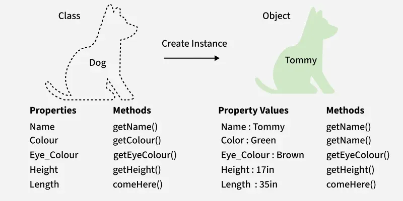
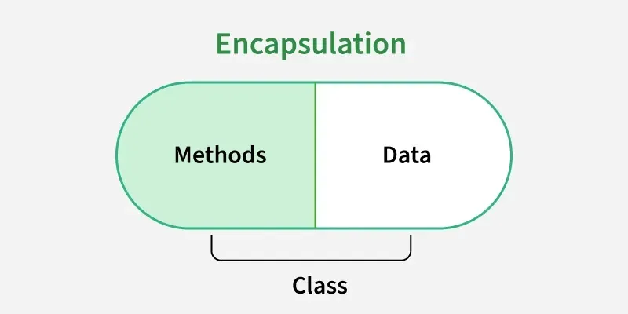
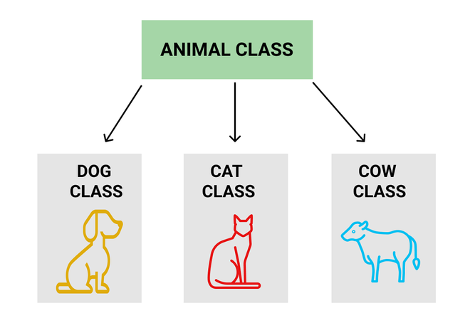
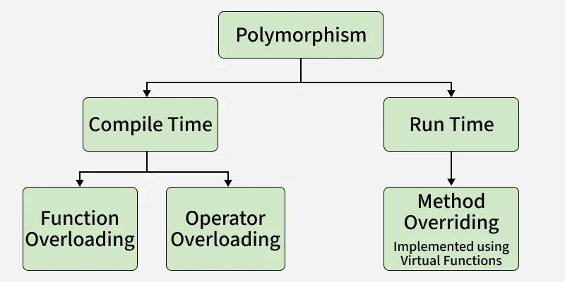

# C / C++ — C++ object-oriented programming

[← C/C++ README](./README.md)

This topic covers the **object-oriented** part of **C++**: **classes and objects**, the **four pillars** (encapsulation, abstraction, inheritance, polymorphism), **constructors and destructors**, **this**, and **references**. C++ builds on C (topics 1–12) by adding these features so you can model data and behavior together. Each concept is explained in text first, then with code blocks so you can write and read C++ in a clear way.

---

## From C structs to C++ classes

In C, **structs** hold data; you pass them to functions that operate on them. In C++, a **class** bundles **data** (member variables) and **behavior** (member functions) into one type. An **object** is an instance of a class. Classes are the core of C++ OOP: they give you **encapsulation** (hiding implementation) and a place to attach **constructors**, **destructors**, and **inheritance**.




*Image: [GeeksforGeeks – Object Oriented Programming in C++](https://www.geeksforgeeks.org/cpp/object-oriented-programming-in-cpp/)*

The diagram above shows a **class** as a blueprint and an **object** as an instance. The following code illustrates the same idea: a class with data and behavior, then an object that uses it.

**Class example — data and member function:**

```cpp
#include <iostream>
using namespace std;

class Student {
public:
    string name;
    int age;

    void display() {
        cout << name << endl;
    }
};

int main() {
    Student s1;
    s1.name = "Geeksforgeeks";
    s1.display();
    return 0;
}
```

*Output: `Geeksforgeeks`*

**Object example — state, behavior, and encapsulation (private data with getters/setters):**

```cpp
#include <iostream>
#include <string>
using namespace std;

class Employee {
private:
    string name;
    float salary;

public:
    Employee(string name, float salary) {
        this->name = name;
        this->salary = salary;
    }

    string getName() { return name; }
    float getSalary() { return salary; }
    void setName(string name) { this->name = name; }
    void setSalary(float salary) { this->salary = salary; }

    void displayDetails() {
        cout << "Employee: " << name << endl;
        cout << "Salary: " << salary << endl;
    }
};

int main() {
    Employee emp("Geek", 10000.0f);
    emp.displayDetails();
    return 0;
}
```

*Output: `Employee: Geek` and `Salary: 10000`*

Here, `Student` is a class with public members; `Employee` is an object with **state** (name, salary), **behavior** (displayDetails), and **encapsulation** (private data accessed via getters/setters).

---

## Encapsulation: public, private, protected

**Encapsulation** means controlling who can see or change the internals of a class. C++ uses **access specifiers**:

- **public** — Accessible from anywhere (other code, derived classes).
- **private** — Accessible only from inside the class (and friends). Default for **class**.
- **protected** — Accessible from the class and from **derived classes**; not from outside.

Hiding data in **private** and exposing only a **public** interface (member functions) reduces misuse and keeps the design flexible. In C, struct members are all “public”; in C++ you choose.



*Image: [GeeksforGeeks – Encapsulation in C++](https://www.geeksforgeeks.org/cpp/encapsulation-in-cpp/)*

The diagram above shows data and methods in one unit, with access only through public methods. The code below does the same: private data is accessed or modified only via getter and setter functions.

```cpp
#include <iostream>
#include <string>
using namespace std;

class Programmer {
private:
    string name;

public:
    string getName() { return name; }
    void setName(string newName) { name = newName; }
};

int main() {
    Programmer p;
    p.setName("Geek");
    cout << "Name=> " << p.getName() << endl;
    return 0;
}
```

*Output: `Name=> Geek`*

`name` is private; external code cannot access it directly. Only `getName()` and `setName()` provide controlled access, which keeps data consistent and hides implementation details.

---

## Abstraction (pure virtual functions)

**Abstraction** means exposing only what is necessary and hiding implementation details. In C++, you achieve it with **abstract classes**: classes that have at least one **pure virtual function** (`= 0`). You cannot create objects of an abstract class; derived classes must implement the pure virtual functions. This defines a common interface while leaving the "how" to each derived class.

```cpp
#include <iostream>
#include <string>
using namespace std;

class Shape {
protected:
    string color;
public:
    Shape(string color) : color(color) {}
    virtual double area() = 0;
    string getColor() { return color; }
    virtual ~Shape() {}
};

class Rectangle : public Shape {
    double length, width;
public:
    Rectangle(string color, double length, double width) : Shape(color) {
        this->length = length;
        this->width = width;
    }
    double area() override { return length * width; }
};

int main() {
    Shape* s = new Rectangle("Yellow", 2, 4);
    cout << "Rectangle color is " << s->getColor() << " and area is : " << s->area() << endl;
    delete s;
    return 0;
}
```

*Output: `Rectangle color is Yellow and area is : 8`*

`Shape::area() = 0` makes `Shape` abstract. Callers use the `Shape*` interface; the real logic (rectangle area) is hidden inside `Rectangle`. That is abstraction: same interface, implementation in derived classes.

---

## Constructors and destructors

A **constructor** is a special member function that runs when an object is **created**. It has the same name as the class and no return type. It is used to initialize member variables and acquire resources. A **destructor** runs when an object is **destroyed** (e.g. when it goes out of scope or is deleted). It has the name `~ClassName()` and is used to release resources (close files, free memory).

```cpp
class Buffer {
   char* data;
   size_t size;
public:
   Buffer(size_t n) : size(n) {
      data = new char[n];
   }
   ~Buffer() {
      delete[] data;
   }
   char& at(size_t i) { return data[i]; }
};

int main() {
   Buffer buf(100);
   buf.at(0) = 'a';
   return 0;
}
```

The constructor allocates `data`; the destructor frees it. This **RAII** pattern (resource acquisition in initialization) is central in C++: resources are tied to object lifetime, so you avoid leaks and use-after-free when used correctly.

---

## Inheritance

**Inheritance** lets you define a new class (**derived**) that extends an existing one (**base**). The derived class gets the base’s members (subject to access rules) and can add new ones or **override** behavior. Syntax: `class Derived : public Base { ... };`. **public** inheritance means “is-a”: a derived object is a kind of base.



*Image: [GeeksforGeeks – Inheritance in C++](https://www.geeksforgeeks.org/cpp/inheritance-in-c/)*

The diagram shows a base class and derived classes (e.g. Animal → Dog, Cat, Cow). The code below matches that idea: one base class and several derived classes that reuse and extend it.

**Example: Animal (base) and Dog, Cat, Cow (derived):**

```cpp
#include <iostream>
using namespace std;

class Animal {
public:
    void sound() { cout << "Animal makes a sound" << endl; }
};

class Dog : public Animal {
public:
    void sound() { cout << "Dog barks" << endl; }
};

class Cat : public Animal {
public:
    void sound() { cout << "Cat meows" << endl; }
};

class Cow : public Animal {
public:
    void sound() { cout << "Cow moos" << endl; }
};

int main() {
    Dog d;
    d.sound();
    Cat c;
    c.sound();
    Cow cow;
    cow.sound();
    return 0;
}
```

*Output: `Dog barks`, `Cat meows`, `Cow moos`*

**Example: virtual function and override (for polymorphism):**

```cpp
class Shape {
public:
    virtual double area() const { return 0; }
};

class Circle : public Shape {
    double radius;
public:
    Circle(double r) : radius(r) {}
    double area() const override { return 3.14159 * radius * radius; }
};

class Rectangle : public Shape {
    double w, h;
public:
    Rectangle(double width, double height) : w(width), h(height) {}
    double area() const override { return w * h; }
};
```

`Circle` and `Rectangle` inherit from `Shape` and override `area()`. Declaring `area()` as **virtual** in the base means that when you call it through a **base pointer or reference**, the **derived** version runs (runtime polymorphism).

---

## Polymorphism (virtual functions)

**Polymorphism** means “one interface, many implementations.” C++ supports **compile-time polymorphism** (e.g. function overloading, operator overloading) and **runtime polymorphism** (virtual functions and overriding). When a base class declares a function **virtual**, the derived class can **override** it; calls through a **pointer or reference to the base** then invoke the **derived** implementation. That is **dynamic dispatch** (runtime choice based on the actual object type).



*Image: [GeeksforGeeks – Polymorphism in C++](https://www.geeksforgeeks.org/cpp/cpp-polymorphism/)*

The diagram shows one interface with many implementations. The code below demonstrates **runtime polymorphism**: a base class pointer calling the derived class function.

**Runtime polymorphism — base pointer calls derived implementation:**

```cpp
#include <iostream>
using namespace std;

class Base {
public:
    virtual void display() { cout << "Base class function"; }
};

class Derived : public Base {
public:
    void display() override { cout << "Derived class function"; }
};

int main() {
    Base* basePtr;
    Derived derivedObj;
    basePtr = &derivedObj;
    basePtr->display();
    return 0;
}
```

*Output: `Derived class function`*

The base pointer points to a `Derived` object; `basePtr->display()` runs the **derived** version because `display()` is virtual (**dynamic dispatch**).

**Same idea with the Shape hierarchy:**

```cpp
#include <iostream>

void print_area(const Shape& s) {
    std::cout << s.area() << std::endl;
}

int main() {
    Circle c(5.0);
    Rectangle r(4.0, 6.0);
    print_area(c);
    print_area(r);
    return 0;
}
```

`print_area` takes a **const reference to Shape**; it does not need to know whether the object is a `Circle` or `Rectangle`. The correct `area()` is called because `area()` is virtual and overridden. Without **virtual**, the base’s `area()` would be called (static binding).

**Override keyword:** In derived classes, use **`override`** on virtual function redefinitions so the compiler checks that the base really has a matching virtual function.

---

## The this pointer

Inside a member function, **`this`** is a pointer to the current object. You use it when a parameter or local variable shadows a member name, or when you need to pass the object’s address (e.g. to another function or to return a reference to the object).

```cpp
class Box {
   int value;
public:
   void set(int value) {
      this->value = value;
   }
   int get() const { return value; }
};
```

Here `this->value` refers to the member; `value` alone would be the parameter.

---

## References (C++)

C++ **references** are aliases for existing objects. They must be initialized when created and cannot be rebound. They are often used for parameters (no copy, no null) and for return values (e.g. returning a member). They are not pointers: no pointer arithmetic, no null, and syntax uses `&` in the declaration, not in the call.

```cpp
void swap(int& a, int& b) {
   int t = a;
   a = b;
   b = t;
}

int main() {
   int x = 1, y = 2;
   swap(x, y);
   return 0;
}
```

Passing by reference avoids copying and lets the function modify the caller’s variables. For read-only use, use **const reference** (`const int&`) to avoid copies without allowing modification.

---

## Summary: C++ OOP at a glance

| Concept | What it does |
| --- | --- |
| **Class** | Bundles data and member functions; defines a type. |
| **Object** | Instance of a class; has state, behavior, identity. |
| **Encapsulation** | public / private / protected control access; getters/setters for private data. |
| **Abstraction** | Abstract class with pure virtual function(s); implementation in derived classes. |
| **Constructor** | Runs on creation; initializes and acquires resources. |
| **Destructor** | Runs on destruction; releases resources (RAII). |
| **Inheritance** | Derived class extends base; gets base members and can override. |
| **Polymorphism** | virtual functions; call through base pointer/reference runs derived implementation. |
| **this** | Pointer to the current object inside a member function. |
| **References** | Aliases; used for parameters and returns without copying. |

C++ OOP is used everywhere: game engines, browsers, system libraries, and security-sensitive code. Understanding classes, inheritance, and polymorphism helps you read and audit C++ codebases and reason about object lifetimes and virtual dispatch.

---

## Further reading

- [Object Oriented Programming in C++ (GeeksforGeeks)](https://www.geeksforgeeks.org/cpp/object-oriented-programming-in-cpp/) — Classes, objects, four pillars (abstraction, encapsulation, inheritance, polymorphism).
- [Encapsulation in C++ (GeeksforGeeks)](https://www.geeksforgeeks.org/cpp/encapsulation-in-cpp/) — Getter/setter pattern, Programmer example.
- [Inheritance in C++ (GeeksforGeeks)](https://www.geeksforgeeks.org/cpp/inheritance-in-c/) — Animal/Dog/Cat/Cow, types of inheritance.
- [Abstraction in C++ (GeeksforGeeks)](https://www.geeksforgeeks.org/cpp/abstraction-in-cpp/) — Abstract classes, pure virtual functions.
- [Polymorphism in C++ (GeeksforGeeks)](https://www.geeksforgeeks.org/cpp/cpp-polymorphism/) — Compile-time vs runtime, overloading and overriding.
- [C++ Tutorial (TutorialsPoint)](https://www.tutorialspoint.com/cplusplus/index.htm) — C++ and OOP overview.
- [C++ reference — Classes (cppreference)](https://en.cppreference.com/w/cpp/language/classes)
- [C++ reference — Inheritance (cppreference)](https://en.cppreference.com/w/cpp/language/derived_class)
- [C/C++ README](./README.md) — Topic index.
