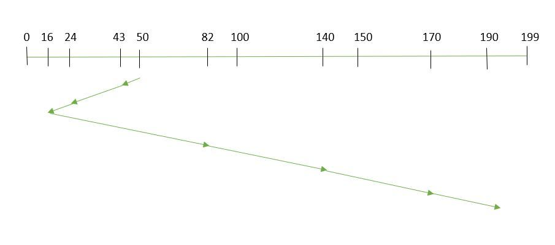
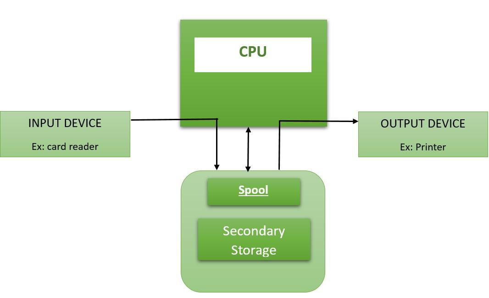
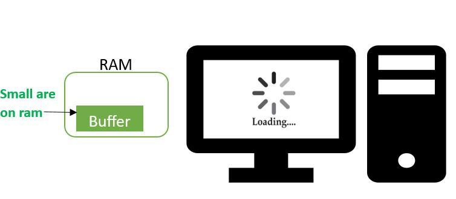

# Storage and I/O (Disk / I/O Management)

[← Back to Fundamentals](./README.md) · [↑ Operating Systems](../README.md)

This topic covers **file systems**, **disk scheduling** algorithms, device management, and **buffering vs spooling** — **OS-agnostic**. For the file system as seen by programs (open, read, write, links, mounting), see [File system interface](./17_File_System_Interface.md).

---

## 1. File systems in Operating System

A **file system** is the OS layer that organizes data on **block devices** (disks, SSDs) into **files** and **directories** (or the equivalent) and provides:

- **Naming** — Hierarchical names (paths); each file and directory has a name and a unique identifier (e.g. inode number) inside the file system.
- **Structure** — Directories contain other directories and files; links (hard links, symbolic links) allow multiple names for the same data or indirection.
- **Mapping** — Logical files (bytes, blocks) are mapped to **physical blocks** on the device. The file system maintains **metadata** (size, permissions, timestamps, location of blocks) for each file.
- **Protection** — Access control (e.g. read, write, execute per user/group); the kernel checks permissions on open and access.
- **Consistency** — After a crash, the file system must be recoverable (e.g. via journaling or copy-on-write and replay).

**Allocation methods** (how file data is laid out on disk):

- **Contiguous** — File occupies consecutive blocks. Simple; fast sequential access; **external fragmentation** and growth are problematic.
- **Linked** — Each block has a pointer to the next; directory or inode holds the first block. No external fragmentation; random access is slow; one corrupted pointer can lose the rest.
- **Indexed** — An index block (or multiple levels of index) holds pointers to data blocks. Good for random access; index block has fixed size (limits file size unless multi-level).

Modern file systems use variants of **indexed** allocation (e.g. inodes with direct, single-indirect, double-indirect block pointers) and structures (e.g. B-trees) for directories and large files.

---

## 2. Disk scheduling algorithms

### Disk access time: seek time, rotational latency, transfer time

For a **moving-head disk (HDD)**, the time to complete an I/O request is the sum of:

| Component | Meaning |
|-----------|---------|
| **Seek time** | Time to move the **read/write head** to the target **cylinder** (track). The head moves radially; seek time depends on how far it must move and the hardware’s seek speed. Dominant for **random** I/O. |
| **Rotational latency** | Once on the right track, time for the **sector** to rotate under the head. On average, half a rotation (e.g. 2–4 ms for 7200 RPM). |
| **Transfer time** | Time to **read or write** the requested data (one or more sectors) as the disk rotates. Depends on rotation speed and amount of data. |

**Disk access time** = seek time + rotational latency + transfer time. Visual (moving-head disk, single read):

```
                    Platter (top view)
    Track 0  ─────────────────────────────
    Track 1  ─────────────────────────────     Sector 0
    Track 2  ─────────────────────────────     Sector 1
    Track 3  ─────────────────────────────  ●  Sector 2  ← head here
    ...     ─────────────────────────────     ...
             ↑
             Head moves radially (SEEK) to target track

  Step 1: SEEK TIME     — move head to correct cylinder (track)
  Step 2: ROTATIONAL   — wait for disk to rotate so desired sector
           LATENCY        is under the head (avg ≈ half rotation)
  Step 3: TRANSFER     — read/write data as sector(s) pass under head
           TIME

  Total disk access time = seek time + rotational latency + transfer time
```

The OS **scheduler** reorders requests to reduce **seek time** (and thus total access time) by serving requests near the current head position. **SSDs** have no moving parts: no seek or rotational latency, so disk scheduling for SSDs is more about **queue depth** and **fairness** than about head movement.

### Scheduling algorithms

The **disk** (or SSD) has a **queue** of I/O requests (read/write at logical block address, or at cylinder/head/sector for traditional disks). The OS (or the device driver / block layer) **schedules** these requests to minimize **seek time** (for HDDs) and **latency** and to maximize **throughput**.

**Assumptions for classic algorithms:** Moving head disk; seek time dominates for random I/O. (SSDs have no seek; scheduling is more about queue depth and fairness.)

| Algorithm | Idea |
|-----------|------|
| **FCFS** | First-Come, First-Served. Simple; no reordering. Can be inefficient (e.g. head moves back and forth). |
| **SSTF (Shortest Seek Time First)** | Serve the request **closest** to the current head position. Reduces seek time but can **starve** requests that are far away. |
| **SCAN (elevator)** | Move the head in **one direction**, serving all requests along the way; when no more requests ahead, **reverse** direction. Fairer than SSTF. |
| **C-SCAN** | Like SCAN but when the head reaches the end, **jump back to the start** (or the first request) and scan again. Reduces variance in wait time. |
| **LOOK / C-LOOK** | Like SCAN / C-SCAN but **stop** when there are no more requests in the current direction (do not go to the physical end). More efficient when the queue is not full. |


*Image: [Disk Scheduling Algorithms](https://www.geeksforgeeks.org/operating-systems/disk-scheduling-algorithms/).*



*Image: [Disk Scheduling Algorithms](https://www.geeksforgeeks.org/operating-systems/disk-scheduling-algorithms/) (SSTF).*

Modern systems often use a **combination** (e.g. deadline scheduler, or anticipatory scheduler) and treat SSDs differently (no seek, so FCFS or fairness-oriented).

---

## Device management (concepts)

The OS **device management** includes:

- **Abstraction** — Devices are exposed to applications as a **uniform interface**: e.g. “open device,” “read/write blocks,” “ioctl for control.” The application does not know the exact hardware.
- **Drivers** — Kernel (or user-space) code that talks to the hardware: init, read, write, interrupt handling. The rest of the kernel uses a **driver interface** (e.g. block layer, character device layer).
- **Scheduling** — For block devices, the I/O scheduler orders requests (as above). For other devices, the kernel may queue requests and service them in order or by priority.
- **Buffering / caching** — Data is often **buffered** in RAM: writes are acknowledged when they hit the buffer, then flushed to disk later; reads are satisfied from cache when possible. This reduces direct device access and smooths throughput.

**Block devices** vs **character devices:** Block devices (disks) support random access in fixed-size blocks; the OS typically has a **buffer cache** or **page cache** in front of them. Character devices (terminals, keyboards, some sensors) are often stream-oriented; data is read/written in a stream.

---

## 4. Spooling vs Buffering

| Term | Meaning | Use |
|------|---------|-----|
| **Buffering** | Temporary storage (usually in **memory**) to **smooth** the rate mismatch between producer and consumer (e.g. CPU produces data fast, disk consumes it slowly). The buffer holds data until the consumer can take it (or until it is flushed to device). | General I/O; reduce wait; batch writes. |
| **Spooling** (Simultaneous Peripheral Operations On-Line) | **Off-line** buffering: data is written to **disk** (or a dedicated queue) so that a **slow device** (e.g. printer) can process it **later** while the application continues. The “spool” is the on-disk queue. | Print queues; batch job queues; decoupling producer from slow device. |

So: **buffer** = in-memory, short-term smoothing; **spool** = on-disk (or persistent) queue for a shared or slow device.



*Image: [Difference between Spooling and Buffering](https://www.geeksforgeeks.org/operating-systems/difference-between-spooling-and-buffering/) (spooling).*



*Image: [Difference between Spooling and Buffering](https://www.geeksforgeeks.org/operating-systems/difference-between-spooling-and-buffering/) (buffering).*

---

## 5. RAID (storage subsystem)

**RAID** (Redundant Array of Independent Disks) is a **storage architecture** that combines multiple physical disks into one or more logical units using **striping**, **mirroring**, and/or **parity**. The OS (or a RAID controller / software stack) sees the result as **block devices** and uses them for file systems and swap. RAID levels and data formats are standardized by the Storage Networking Industry Association (SNIA) in the Common RAID Disk Data Format (DDF); the numbers (0, 1, 2, …) are **identifiers**, not performance or generation metrics.

**Important:** RAID protects against **hard** failures (defective sectors, drive failure) and can recover from them. It does **not** protect against **catastrophic** loss (fire, water) or **soft** errors (user error, software bugs, malware). For valuable data, RAID is one building block; it does **not** replace a **backup** plan.

---

### Core ideas

- **Striping** — Data is split into **chunks** (stripes) and spread across disks. Each stripe is written in parallel across members; reads can be parallel too. **Throughput** can scale with the number of disks. No redundancy by itself; if one disk fails, the array fails.
- **Mirroring** — The same data is written to two or more disks. If one fails, the other(s) have a copy. **Capacity** = size of the smallest member; **cost** = 2× (or more) space for 1× usable capacity.
- **Parity** — Redundant information (e.g. **XOR** of data blocks, or stronger **erasure codes**) is stored on one or more disks. If one (or two, in dual-parity) data disk fails, the missing blocks can be **reconstructed** from the remaining data plus parity. Fewer extra disks than mirroring, but **rebuild** and **write** behavior are more complex.

**Concepts used in practice (software and hardware RAID):**

- **Chunk (stripe size)** — The unit of data written to each disk in a stripe. Minimum is often 4 KB; larger chunks can improve sequential I/O, smaller can help random I/O. Chunk size is defined at array creation and affects performance.
- **Hot spare** — A spare drive attached to the array that is not used for data until a member fails. When a drive fails, the controller (or software stack) can automatically replace it with the hot spare and start a **rebuild**, improving availability without manual intervention.

---

### RAID 0 (striping, no redundancy)

**RAID 0** (stripe set / striped volume) **stripes** data evenly across two or more disks with **no parity** and **no mirroring**. Fault tolerance: **none**. One drive failure causes **entire array** failure.

- **Capacity:** Total = sum of member sizes, but if disks differ, usable space is limited by the **smallest** disk × number of disks (e.g. 120 GB + 320 GB → 240 GB in many implementations; the rest of the large disk may be unused or used elsewhere).
- **Stripe size** is fixed at creation; all I/O is aligned to stripes across disks.
- **Performance:** In theory, read/write transfer rate can be up to **n×** a single disk (n = number of disks) because stripes are accessed in parallel. In practice, gains depend on workload; some benchmarks show marginal gains for desktop use, better for sequential or multi-threaded I/O.
- **Use:** Applications that need **maximum throughput** and can tolerate **no redundancy** (e.g. scratch space, caching, gaming, some HPC).

```
  RAID 0 (two disks):     Stripe 1    Stripe 2    Stripe 3
  Disk0:  A1  A3  A5 ...   (A1,A2)     (A3,A4)     (A5,A6)
  Disk1:  A2  A4  A6 ...   ↑ parallel   ↑           ↑
  Failure of either disk → entire array lost.
```

---

### RAID 1 (mirroring)

**RAID 1** keeps an **exact copy** (mirror) of the data on two or more disks. No striping, no parity. The array is only as large as the **smallest** member.

- **Capacity:** 1/n × total raw (e.g. 2 × 1 TB → 1 TB usable).
- **Fault tolerance:** Array keeps operating as long as **at least one** member is operational. With two disks, one failure is tolerated; with three mirrors, two failures, etc.
- **Read performance:** Any read can be served by any member; under favorable I/O patterns, **random read** can approach the **sum** of member speeds. **Write performance:** Every write must go to all members, so **write** is limited to the **slowest** disk.
- **Use:** When **reliability** or **read performance** matters more than capacity or write speed (e.g. boot/system volumes, small high-availability sets).

```
  RAID 1 (mirror):        Same data on both disks
  Disk0:  D1  D2  D3 ...
  Disk1:  D1  D2  D3 ...
  One disk can fail; array stays up.
```

---

### RAID 2 (bit-level striping with Hamming code)

**RAID 2** uses **bit-level** striping (not block or byte) and **Hamming code** (or similar) for **error correction**, not simple XOR parity. Disks are **synchronized** (spindles in lockstep) so that the same bit positions are under the heads at the same time. Typically only **one** read or write request is in flight at a time.

- **Capacity:** A fraction of raw (e.g. 7 disks might hold 4 disks’ worth of data; the rest are ECC).
- **Why it is obsolete:** Modern hard drives already include **built-in error correction**. The extra complexity of RAID 2’s external Hamming code adds little benefit over simpler parity-based RAID. **RAID 2 was rarely implemented and is the only original RAID level that is no longer used in practice.** It appears in curricula and historical material (e.g. Thinking Machines’ DataVault, IBM Stretch) but not in current deployments.

---

### RAID 3 (byte-level striping, dedicated parity disk)

**RAID 3** uses **byte-level** striping with a **single dedicated parity disk**. All parity bytes live on that one disk. Disks are usually **synchronized** (lockstep); data for a single logical block is spread across all data disks plus the parity disk.

- **Capacity:** (n − 1) × size of smallest disk (n = total disks; one is parity).
- **Fault tolerance:** One disk failure (data or parity); missing data is reconstructed from the others.
- **Performance:** **Large sequential** reads/writes can achieve high transfer rates (all disks participate). **Random small** I/O is poor: every logical block touches every disk, so many small requests cause seeks on all members and only one request is typically serviced at a time. The **dedicated parity disk** can become a bottleneck on writes.
- **Use:** Rare. Suited to workloads that need **very high sequential** throughput (e.g. uncompressed video). **RAID 3 (and RAID 4) were quickly replaced by RAID 5**, which distributes parity and avoids the single-parity-disk bottleneck.

```
  RAID 3 (conceptual):    Byte stripes across data disks; P = parity disk
  D0:  b0  b3  b6 ...    (b0,b1,b2) → P0   (b3,b4,b5) → P1
  D1:  b1  b4  b7 ...
  D2:  b2  b5  b8 ...
  P:   P0  P1  P2 ...
```

---

### RAID 4 (block-level striping, dedicated parity disk)

**RAID 4** uses **block-level** striping (not byte) with a **single dedicated parity disk**. Each stripe has several **data blocks** (one per data disk) and **one parity block** (always on the same disk).

- **Capacity:** (n − 1) × size of smallest disk.
- **Fault tolerance:** One disk failure.
- **Performance:** **Random reads** can be good: a read of block A1 needs only the disk that holds A1. **Random writes** are worse: every write updates parity, so the **parity disk** is involved in every write and becomes the **bottleneck**. RAID 5 avoids this by **distributing** parity across all disks.
- **Advantage over RAID 3:** Block-level access allows **multiple concurrent** I/O requests (e.g. read A1 from disk 0 and B2 from disk 1 at the same time). One advantage of RAID 4 is that it can be **extended online** (add disks) without full parity recomputation if new disks are zero-filled.
- **Use:** Rare; **RAID 5** (distributed parity) is used instead in practice.

---

### RAID 5 (block-level striping, distributed parity)

**RAID 5** uses **block-level** striping with **distributed parity**: parity is **rotated** across disks (no single parity disk). Requires **at least three** disks. All members but one must be present to operate; after one failure, reads are computed from the remaining data and parity.

- **Capacity:** (n − 1) × size of smallest disk. **Space efficiency** = 1 − 1/n (e.g. 5 disks → 80%).
- **Fault tolerance:** **One** drive failure. Rebuild uses the other disks + parity to reconstruct the failed member.
- **Layout:** Many variants exist (e.g. left/right synchronous/asynchronous, parity at start or end of stripe). They differ in how stripes and parity blocks are ordered; the principle (distributed parity) is the same.
- **Write behavior / small-write penalty:** Parity is computed over a **full stripe**. Writing **less than a full stripe** forces a **read-modify-write (RMW)**: read old data and old parity, compute new parity from old data + new data, write new data and new parity. So **small writes** cost multiple disk ops (read old stripe, write new stripe) and can be **2× or 4×** slower than large sequential writes. **Reconstruct-write (RCW)** is an alternative (read all other blocks in the stripe, recompute parity, write) and can be faster for small arrays or degraded stripes.
- **Use:** General-purpose balance of **capacity**, **redundancy**, and **read performance**; common in servers and NAS.

```
  RAID 5 (distributed parity):   Parity block rotates (e.g. right-to-left)
  D0:   D1   D2   P     D5   D6   P     ...
  D1:   D3   P    D4    D7   P    D8    ...
  D2:   P    D9   D10   P    D11  D12   ...
  One disk can fail; rebuild from remaining data + parity.
```

---

### RAID 6 (block-level striping, dual distributed parity)

**RAID 6** extends RAID 5 with a **second** parity block per stripe (often called **P** and **Q**). It tolerates **two** simultaneous drive failures. Minimum **four** disks.

- **Capacity:** (n − 2) × size of smallest disk. **Space efficiency** = 1 − 2/n (e.g. 6 disks → 2/3).
- **Fault tolerance:** **Two** drive failures. Important when **rebuild time** is long (large disks) and a second failure during rebuild would be catastrophic.
- **Parity computation:** P is typically XOR (like RAID 5); Q uses a different **erasure code** (e.g. **Reed–Solomon**) so that two missing blocks can be recovered. Q therefore needs more **CPU** (or dedicated hardware). Read performance for **undamaged** data is similar to RAID 5; the extra cost shows mainly on **writes** and during **rebuild**.
- **Use:** When **availability** and **rebuild safety** matter more than raw capacity and write speed (e.g. large SATA arrays, archival).

---

### Nested RAID (RAID 10, 01, 50, 60)

**Nested** levels combine two standard levels. Common ones:

- **RAID 10** (1+0): **Mirror** pairs first, then **stripe** across the pairs. Example: 4 disks = 2 mirrored pairs, data striped across the two pairs. **Capacity** = n/2 × smallest disk. Tolerates **one failure per mirror** (e.g. one disk in each pair). **RAID 10** is preferred over **RAID 01** (stripe of mirrors) because in 01 a single pair failure loses the whole array; in 10, you can lose one disk per pair.
- **RAID 01** (0+1): Stripe first, then mirror the stripe set. One entire stripe-set failure loses the array.
- **RAID 50 / 60:** Stripe across several **RAID 5** or **RAID 6** arrays. Higher capacity and throughput than a single RAID 5/6; more disks to manage.

```
  RAID 10 (mirror then stripe):   Pair0: [D0, D0']   Pair1: [D1, D1']
  Stripe 0:  (D0, D1)   Stripe 1:  (D0', D1')   ...
  Survives one failure in Pair0 and one in Pair1.
```

---

### Comparison: levels at a glance

| Level | Description | Min disks | Space efficiency | Fault tolerance |
|-------|-------------|-----------|------------------|-----------------|
| **RAID 0** | Block striping, no parity/mirror | 2 | 1 (100%) | None |
| **RAID 1** | Mirroring | 2 | 1/n | n − 1 failures |
| **RAID 2** | Bit striping + Hamming | 3+ | 1 − (1/n) log₂(n+1) approx. | One failure (obsolete) |
| **RAID 3** | Byte striping + dedicated parity | 3 | 1 − 1/n | One failure (rare) |
| **RAID 4** | Block striping + dedicated parity | 3 | 1 − 1/n | One failure (rare) |
| **RAID 5** | Block striping + distributed parity | 3 | 1 − 1/n | One failure |
| **RAID 6** | Block striping + dual distributed parity | 4 | 1 − 2/n | Two failures |
| **RAID 10** | Stripe of mirrors | 4 | 1/2 | One per mirror pair |

---

### Performance and system implications

- **Stripe size:** Choice of **stripe width** (and chunk size) affects sequential vs random performance and alignment with file system block size. Too small → more overhead; too large → poor small-I/O utilization.
- **Small-write penalty:** Parity-based levels (3, 4, 5, 6) pay a **read-modify-write** or **reconstruct-write** cost when updating less than a full stripe. RAID 1 and RAID 10 do not have this parity-update cost.
- **Controller and SSDs:** With **high-speed SSDs**, the **RAID controller** or software stack can become the **bottleneck**; benchmarks show that controller capability matters as much as disk count for peak throughput.
- **Rebuild:** After a failure, **rebuild** (reconstructing the failed member onto a spare) stresses the remaining disks and can take hours on large drives. During rebuild, a second failure in RAID 5 loses the array; RAID 6 tolerates two failures.

---

### How the OS sees RAID

- **Hardware RAID** — A controller (card or onboard) performs RAID. The OS sees a **single block device** (e.g. `/dev/sda`). The OS does not see individual disks; the driver and firmware handle the array.
- **Software RAID** — The **OS** (e.g. Linux **mdadm**, Windows Storage Spaces, BSD GEOM, ZFS) combines disks. The OS sees raw disks and creates a **RAID device** (e.g. `/dev/md0`) used for a file system or LVM. Same concepts (striping, mirroring, parity); the **CPU** does the work (or offload to hardware where available).

From the **datacenter** perspective: servers often use **hardware RAID** for boot/system and **software RAID** or **erasure coding** (in distributed storage) for data. RAID is one layer **below** the file system and **above** (or alongside) raw disks.

---

## Summary

- **File system:** Organizes block device into files and directories; naming, structure, metadata, protection, allocation (contiguous, linked, indexed). Modern systems use indexed allocation and structures like B-trees.
- **Disk scheduling:** Order I/O requests to reduce seek (HDD) and latency. FCFS, SSTF, SCAN, C-SCAN, LOOK, C-LOOK. SSDs change the trade-offs (no seek).
- **Device management:** Abstraction (uniform interface), drivers (hardware-specific code), scheduling (order of requests), buffering/caching (smooth access).
- **Buffering** = in-memory smoothing of producer/consumer rates. **Spooling** = persistent (e.g. on-disk) queue for a slow or shared device (e.g. printer).
- **RAID:** Storage subsystem (striping, mirroring, parity). Core concepts include **chunk (stripe size)** (min often 4 KB; affects I/O) and **hot spare** (spare drive for automatic rebuild). Levels 0–6 and nested (10, 50, 60): capacity, space efficiency, fault tolerance, and performance (e.g. small-write penalty, dedicated vs distributed parity) differ by level. RAID 2 is obsolete (built-in drive ECC); 3/4 largely superseded by 5. RAID does not replace backup. OS sees hardware RAID as one block device or software RAID (mdadm, geom, ZFS, Storage Spaces) as a logical device.

This is **operating system basics**. How a particular OS implements file systems (e.g. VFS, ext4, NTFS), disk scheduling, and device drivers is covered in the [Linux](../Linux/README.md) and [Windows](../Windows/README.md) sections.

---

## Further reading

- [Standard RAID levels (Wikipedia)](https://en.wikipedia.org/wiki/Standard_RAID_levels) — In-depth treatment of RAID 0–6, nested levels, space efficiency, fault tolerance, performance, and the note that RAID 2 is no longer used in practice (modern drives have built-in ECC).
- **RAID (Linux mdadm, step-by-step):** [Part 1 – Introduction to RAID, concepts and levels](https://www.tecmint.com/understanding-raid-setup-in-linux/) · [Part 2 – RAID 0 (stripe)](https://www.tecmint.com/create-raid0-in-linux/) · [Part 3 – RAID 1 (mirror)](https://www.tecmint.com/create-raid1-in-linux/) · [Part 4 – RAID 5](https://www.tecmint.com/create-raid-5-in-linux/) · [Part 5 – RAID 6](https://www.tecmint.com/create-raid-6-in-linux/) · [Part 6 – RAID 10](https://www.tecmint.com/create-raid-10-in-linux/) · [Part 7 – Grow array and remove failed disks](https://www.tecmint.com/grow-raid-array-in-linux/) · [Part 8 – Recover and rebuild failed RAID](https://www.tecmint.com/recover-data-and-rebuild-failed-software-raid/) · [Part 9 – Manage RAID with mdadm](https://www.tecmint.com/manage-software-raid-devices-in-linux-with-mdadm/) · [Assemble RAID and backups (LFCS)](https://www.tecmint.com/creating-and-managing-raid-backups-in-linux/).
- [Operating System Tutorial – Disk Management](https://www.geeksforgeeks.org/operating-systems/operating-systems/) (see Disk Management section)
- [File Systems in Operating System](https://www.geeksforgeeks.org/operating-systems/file-systems-in-operating-system/)
- [File Allocation Methods](https://www.geeksforgeeks.org/operating-systems/file-allocation-methods/)
- [Structures of Directory](https://www.geeksforgeeks.org/operating-systems/structures-of-directory-in-operating-system/)
- [Free Space Management](https://www.geeksforgeeks.org/operating-systems/free-space-management-in-operating-system/)
- [Disk Scheduling Algorithms](https://www.geeksforgeeks.org/operating-systems/disk-scheduling-algorithms/)
- [Secondary Memory](https://www.geeksforgeeks.org/computer-science-fundamentals/secondary-memory/)
- [Spooling vs Buffering](https://www.geeksforgeeks.org/operating-systems/difference-between-spooling-and-buffering/)
- [What exactly Spooling is](https://www.geeksforgeeks.org/operating-systems/what-exactly-spooling-is-all-about/)
- [Unix File System](https://www.geeksforgeeks.org/operating-systems/unix-file-system/)
