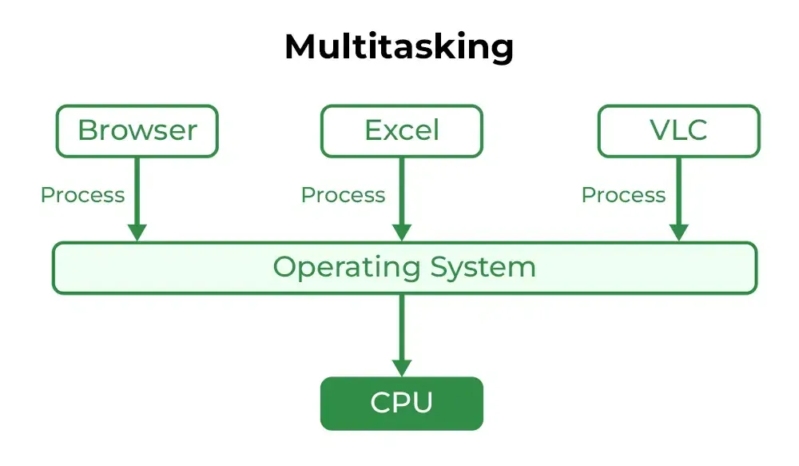
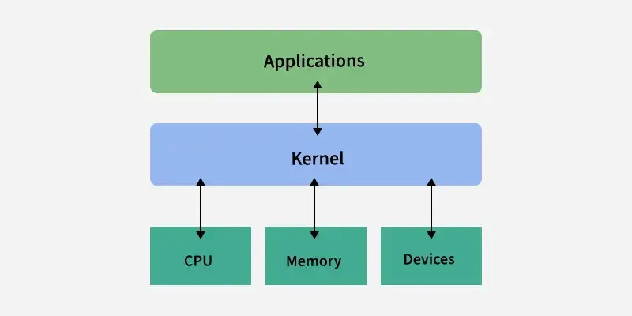
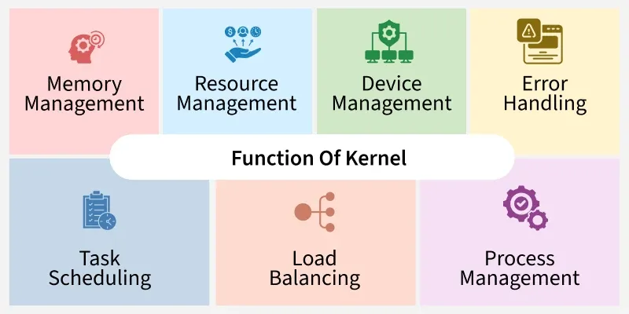
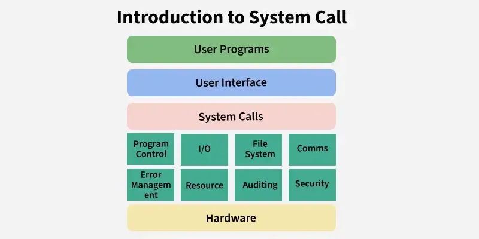
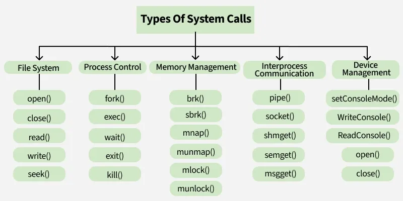

# Kernel and OS architecture (OS Basics)

[← Back to Fundamentals](./README.md) · [↑ Operating Systems](../README.md)

This topic covers **why we need an OS**, **types of operating systems**, the **kernel**, and **system calls** — all OS-agnostic. For boot (what happens when we turn on the computer), see [15_Boot_Process_Detailed](./15_Boot_Process_Detailed.md).

---

## 1. Introduction to Operating System

### Why do we need an operating system?

Without an OS, every program would have to:

- **Drive hardware directly** — Own the CPU, memory, and every device. No sharing; one program would monopolize the machine.
- **Implement its own** drivers, file systems, and network stacks. No reuse, no standard interface.
- **Trust every other program** — No isolation; one bug could corrupt another program or crash the machine.

An **operating system** exists to:

1. **Abstract hardware** — Present a stable interface (processes, files, sockets) so programs do not depend on raw hardware.
2. **Share resources fairly and safely** — Multiplex CPU, memory, and I/O among many programs; enforce isolation so one cannot break another.
3. **Provide common services** — File systems, networking, scheduling, so that applications can focus on their logic instead of reimplementing the machine.

So the OS is the **necessary layer** between “bare hardware” and “many programs running safely and efficiently.” The **kernel** is the part of the OS that actually enforces this (privileged code that manages processes, memory, and devices).

### System architecture overview

A typical system is layered:

```
  +------------------------------------------+
  |  Applications (user programs)            |
  +------------------------------------------+
  |  System libraries / runtime (user mode)   |
  +------------------------------------------+
  |  Kernel (privileged)                      |  ← process, memory, I/O, system calls
  +------------------------------------------+
  |  Hardware (CPU, memory, devices)          |
  +------------------------------------------+
```

- **Hardware** — CPU, RAM, disks, network interfaces. The kernel talks to it via drivers and the CPU’s privileged instructions.
- **Kernel** — Single (or minimal) privileged component. Handles interrupts, system calls, process and memory management, and device I/O. Everything that must be trusted and centralized lives here.
- **System libraries** — Run in user mode. Wrap system calls (e.g. “open file” → syscall open). No special privilege.
- **Applications** — Also user mode. Use libraries and system calls; never touch hardware or other processes’ memory directly.

The **boundary** that matters for security and correctness is **user mode vs kernel mode**. Crossing it happens only via **system calls** (and traps/exceptions). This is the **system architecture** in a nutshell.

### What is an operating system?

An **operating system** is the layer of software that:

1. **Abstracts the hardware** — Presents a stable, manageable interface to programs instead of raw CPU, memory, and devices.
2. **Manages resources** — Allocates CPU time, memory, and I/O among competing programs and users.
3. **Enforces isolation and security** — Prevents one program from corrupting another or the OS itself.

The OS is not a single program. It includes:

- **Kernel** — The privileged core that runs in the most trusted mode and implements process, memory, and device management.
- **System libraries and services** — Code that runs in user mode and uses the kernel via a well-defined interface (system calls).
- **User-facing programs** — Shells, GUIs, utilities. These are still “part of the OS” in a broad sense but are not the kernel.

When we say “the OS does X,” we usually mean “the kernel does X” or “kernel + a system service does X.”

### Operating system vs kernel

- **Operating system** — The whole software layer between hardware and applications: the **kernel** plus system libraries, services, and often user-facing tools (shell, GUI). When we say "the OS provides files and processes," the kernel implements the core of that; the rest of the OS builds on it.
- **Kernel** — The **privileged core** of the OS: the component that runs in the highest privilege level, handles interrupts and system calls, and implements process management, memory management, and device I/O. The kernel is **inside** the OS; the OS is the kernel plus everything that runs in user space and uses the kernel.

So: **kernel is a subset of the OS**. The kernel is what talks directly to the hardware; the OS is the full environment (kernel + libraries + services + utilities).

```
  ┌─────────────────────────────────────────────────────────┐
  │  OPERATING SYSTEM (full software layer)                 │
  │  ┌───────────────────────────────────────────────────┐  │
  │  │  User space:  apps, shells, system libraries      │  │
  │  └───────────────────────────────────────────────────┘  │
  │  ┌───────────────────────────────────────────────────┐  │
  │  │  KERNEL (privileged core)  ← subset of OS         │  │
  │  │  process, memory, I/O, system calls, interrupts   │  │
  │  └───────────────────────────────────────────────────┘  │
  └─────────────────────────────────────────────────────────┘
                              │
                              ▼
  ┌─────────────────────────────────────────────────────────┐
  │  HARDWARE (CPU, RAM, devices)                           │
  └─────────────────────────────────────────────────────────┘
```

### Application software vs system software vs operating system

- **Application software** — Programs that serve the user's tasks (browsers, editors, games, business apps). They run in **user mode** and use the OS via system calls and libraries. They do **not** manage hardware or other processes.
- **System software** — Software that supports the operation of the machine and of other software: the **operating system** (kernel, libraries, services), **loaders**, **linkers**, **device drivers** (when not inside the kernel), **firmware**. It is not primarily for end-user tasks but for making the system run.
- **Operating system** — A central part of system software: it manages hardware and provides the environment (processes, files, memory, protection) in which application software runs. So: **application software** runs on top of the **OS**; the **OS** (and its kernel) is **system software**.

---

## 2. Types of Operating Systems

Common types include batch, multiprogramming, multitasking (time-sharing), multiprocessing, real-time, and distributed. The diagram below summarizes how the OS is viewed and how it manages resources.



*Image: [GeeksforGeeks – Types of Operating Systems](https://www.geeksforgeeks.org/operating-systems/types-of-operating-systems/).*

### Multiprogramming vs multitasking vs time-sharing

- **Multiprogramming** — Several programs (jobs) reside in **main memory** at once. When one program blocks (e.g. on I/O), the CPU switches to another so the CPU is kept busy. The goal is **throughput** and **resource utilization**; there is no fixed time slice per program. Switching is often when a process blocks, not on a timer.
- **Multitasking** — Extension of multiprogramming where the CPU is switched between programs **frequently** (e.g. on a **timer interrupt**), giving each a small **time slice**. This creates the illusion of concurrent execution and improves **response time** for interactive use. Multitasking is often used as a synonym for **time-sharing** when the focus is on rapid switching.
- **Time-sharing** — Sharing the computer’s time among **multiple users or tasks** so that each gets a slice of CPU time. The system uses multiprogramming plus **scheduling with time slices** so that each user/task gets a turn. The main goal is **interactive responsiveness** and fair sharing. So: **multiprogramming** = multiple jobs in memory, switch when blocked; **multitasking / time-sharing** = multiple jobs in memory plus **time-sliced** switching so that each runs a little at a time.

Visual (CPU timeline):

```
  MULTIPROGRAMMING (switch when blocked):
  Time ─────────────────────────────────────────────────────►
  Job A  [====run====][wait I/O]        [==run==]
  Job B              [====run====][I/O]        [==run==]
  Job C                        [====run====]...
  → Switch only when current job blocks (e.g. I/O).

  MULTITASKING / TIME-SHARING (switch on timer too):
  Time ─────────────────────────────────────────────────────►
  Job A  [slice][slice]   [slice]   [slice]
  Job B       [slice][slice]   [slice]
  Job C            [slice][slice]   [slice]
  → Each job gets small time slices; switch on timer interrupt.
```

### Real-time: hard vs soft

- **Hard real-time** — **Deadlines must be met**; missing a deadline is considered a **failure** (e.g. flight control, medical devices). The OS must give **deterministic** or **bounded** response and often reserves resources (CPU, memory) for critical tasks. Late results are useless or dangerous.
- **Soft real-time** — **Deadlines are important** but occasionally missing one is acceptable (e.g. video playback, some industrial control). The OS tries to meet deadlines and prioritizes real-time tasks, but the system may still run best-effort workloads; occasional delay is not catastrophic.

Both are **OS types or policies**: the distinction is how the system treats deadlines (must meet vs should meet).

### Network OS vs distributed OS

- **Network operating system** — Each machine runs its **own** OS and is **loosely coupled** over a network. Users and applications are **aware** of multiple machines; they log in to specific nodes, share files via network file systems (e.g. NFS), and send messages (e.g. RPC, HTTP) across the network. **Resource sharing** and **location** are explicit.
- **Distributed operating system** — Presents a **single-system image**: many machines appear as **one** logical system. Processes, file systems, and resources are **transparently** distributed; the user may not know where a process runs or where a file is stored. The OS layer handles placement, replication, and failure. Often used in clusters and research systems; less common than network OS in practice.

Both are **fundamental types** of how multiple machines can be organized; network OS is the common model (each node has its OS, cooperation via network); distributed OS aims for transparency and a single global view.

```
  NETWORK OS:                    DISTRIBUTED OS:
  ┌─────┐  ┌─────┐  ┌─────┐      ┌─────────────────────────────┐
  │Node1│  │Node2│  │Node3│      │  Single-system image        │
  │ OS  │  │ OS  │  │ OS  │      │  (user sees one system)     │
  └──┬──┘  └──┬──┘  └──┬──┘      │  ┌─────┐ ┌─────┐ ┌─────┐    │
     │        │        │         │  │Node1│ │Node2│ │Node3│    │
     └────────┴────────┘         │  └──┬──┘ └──┬──┘ └──┬──┘    │
            network              │     └───────┴───────┘       │
  Users know which node;         │  Placement & replication    │
  explicit NFS, RPC, etc.        │  hidden from user           │
                                 └─────────────────────────────┘
```

---

## 3. Kernel in Operating System

### What is the kernel?

The **kernel** is the part of the OS that:

- Runs in **privileged mode** (kernel mode, supervisor mode, ring 0 — the exact name depends on the CPU). In this mode, the CPU allows access to all instructions and all of memory; user programs cannot run in this mode.
- **Implements the core abstractions**: processes (and threads), virtual memory, file systems (or the interface to them), and device I/O.
- **Responds to hardware events**: interrupts (timer, disk, network) and exceptions (page fault, illegal instruction). The kernel’s interrupt and exception handlers are the entry points for most kernel code.
- **Exposes a controlled interface** to user programs. User code cannot “call into the kernel” arbitrarily; it can only invoke specific **system calls** and, in some designs, send messages to server components. The kernel (and possibly a few trusted servers) is the only code that can touch hardware or other processes’ memory.

So: **kernel = privileged, always-on core that implements processes, memory, I/O, and security, and that user code accesses only via system calls (or equivalent).**



*Image: [GeeksforGeeks – Kernel in Operating System](https://www.geeksforgeeks.org/operating-systems/kernel-in-operating-system/).*

### Functions of the kernel

The kernel is responsible for process management, memory management, device and file-system management, security and access control, inter-process communication, and resource allocation. The following diagram summarizes these functions.



*Image: [GeeksforGeeks – Kernel in Operating System](https://www.geeksforgeeks.org/operating-systems/kernel-in-operating-system/).*

### Privilege levels (rings)

Most CPUs provide at least two **privilege levels**:

| Level | Typical name | What the CPU allows |
|-------|----------------------|----------------------|
| **Privileged** | Kernel mode, supervisor mode, ring 0 | All instructions; access to all memory and device registers; can change privilege and MMU settings. |
| **Unprivileged** | User mode, ring 3 | Only a subset of instructions; memory access restricted by the MMU; no direct device or MMU access. |

Some architectures have more levels (e.g. ring 1, 2 for drivers or hypervisor). The key idea: **user programs run unprivileged; the kernel runs privileged.** When a user program needs the kernel to do something (e.g. read a file), it executes a special instruction (e.g. `syscall`, `int 0x80`) that **traps** into the kernel. The CPU switches to privileged mode and jumps to a kernel entry point. When the kernel returns, the CPU switches back to user mode. This is the only sanctioned way for user code to get the kernel to act.

### Kernel architecture: monolithic vs microkernel

How much code runs in the privileged kernel? This is the main design split.

### Monolithic kernel

- **Idea:** Almost all OS functionality (scheduler, memory management, file systems, device drivers, network stack) runs **inside the kernel** in privileged mode, in one (or a few) large address spaces.
- **Pros:** Fewer mode switches; direct function calls between subsystems; historically good performance and simpler development for “everything in one place.”
- **Cons:** A bug in a driver or file system can crash or compromise the whole kernel; the kernel is large and complex; adding features often means modifying the kernel.

### Microkernel

- **Idea:** The kernel is **minimal**: only the bare minimum runs in privileged mode — typically process/thread management, minimal memory management (address spaces), and **inter-process communication (IPC)**. File systems, drivers, network stacks, etc. run as **separate user-mode (or less-privileged) processes** that communicate with the kernel and with each other via messages.
- **Pros:** A bug in a driver or file server does not necessarily crash the kernel; better isolation; easier to replace or restart a subsystem.
- **Cons:** More context switches and message passing; design and tuning are harder for high performance; the line between “kernel” and “server” must be chosen carefully.

### Hybrid

- **Idea:** A pragmatic middle ground: a mostly monolithic kernel, but some subsystems (e.g. certain drivers or file systems) run in user space or in a restricted mode. Many modern “monolithic” kernels are actually hybrid (e.g. user-mode drivers, some services in user space).

**Summary:** The kernel is the only (or the main) privileged component. In a monolithic design it does almost everything; in a microkernel it does very little and delegates to user-mode servers. Both are valid; the distinction is *what runs in privileged mode*, not “Linux vs Windows.”

---

## 4. System Call

**System calls** are the **only** way user programs can request kernel services (create process, allocate memory, read file, send network packet, etc.). From the program’s point of view, a system call looks like a function call; underneath, it is implemented as:



*Image: [Introduction of System Call](https://www.geeksforgeeks.org/operating-systems/introduction-of-system-call/).*

The following diagram groups system calls by category (process control, file system, device management, memory management, IPC):



*Image: [Introduction of System Call](https://www.geeksforgeeks.org/operating-systems/introduction-of-system-call/).*

1. **User code** puts arguments in a well-defined place (registers and/or memory) and executes a **trap instruction** (e.g. `syscall`, `int 0x80`).
2. The **CPU** switches to privileged mode and jumps to a **kernel trap handler**.
3. The **kernel** checks the call number and arguments, performs the operation (possibly blocking the process), and places the result in a return location.
4. The kernel returns to user mode; **user code** sees the return value (and errno-style error indication if applicable).

So the kernel does **not** “call into user space.” User space calls into the kernel. The kernel’s API to user programs is the **system-call interface**. Everything else (libraries, runtimes) is built on top of that. Examples of system-call categories:

- **Process control** — create process, terminate, wait for child, get/set process attributes.
- **File and I/O** — open, read, write, close, seek; often abstracted as “file descriptors” or “handles.”
- **Memory** — request more heap (e.g. `brk`/`sbrk`), map shared memory; the kernel manages page tables and physical pages.
- **Communication** — create channel (pipe, socket), send/receive messages; the kernel routes data and enforces isolation.
- **Device and system info** — get time, get system info, configure device parameters (via ioctl or similar).

The exact set and names of system calls are **OS-specific** (and sometimes CPU-specific). The *concept* — controlled, trap-based entry into the kernel — is universal.

---

## Request flow within the system

A **request** (e.g. read a file, send a packet) flows: **user space → trap → kernel entry → subsystem → driver (and possibly hardware/interrupt) → back to user.** The kernel is **event-driven**: it runs in response to system calls, interrupts, and exceptions. For a **standalone, visual treatment** of how this works on **any** system (x86, x64, ARM) — with code-block diagrams, I/O and interrupt path, and architecture comparison — see [Request flow and system architecture](./19_Request_Flow_And_System_Architecture.md). For traps and interrupts in detail, see [Interrupts, exceptions, and traps](./14_Interrupts_Exceptions_And_Traps.md); for drivers and I/O, see [Device drivers and I/O subsystem](./16_Device_Drivers_And_IO_Subsystem.md).

---

## What happens when we turn on computer?

The full sequence (firmware → boot loader → kernel → first user process) is covered in **[15_Boot_Process_Detailed](./15_Boot_Process_Detailed.md)** (“What happens when we turn on computer?”). That topic covers firmware (BIOS/UEFI), boot loader (MBR/GPT), kernel load, and init.

---

## Summary

- The **OS** abstracts hardware, manages resources, and enforces security. Its **kernel** is the privileged core that does the real work.
- The **kernel** runs in privileged mode; it implements processes, memory, I/O, and security; user code reaches it **only** via **system calls** (trap instruction → kernel handler → return).
- **Privilege levels** (e.g. ring 0 vs ring 3) ensure user programs cannot bypass the kernel.
- **Monolithic kernel**: most OS code runs in the kernel. **Microkernel**: kernel is minimal; servers in user space. **Hybrid**: mix of both.
- **Boot**: firmware → boot loader → kernel init → first user process (init). The kernel is then event-driven (system calls, interrupts, exceptions).
- **Request flow**: user → trap → kernel → subsystem → driver/hardware → back. For full flow and architecture (x86, x64, ARM) with diagrams, see [Request flow and system architecture](./19_Request_Flow_And_System_Architecture.md).

This is **operating system basics**: the kernel is not “Linux” or “Windows” — it is the concept that every general-purpose OS has such a privileged core. How a particular OS implements it (e.g. Linux’s monolithic design, Windows’ layered design) is the next step, covered in the [Linux](../Linux/README.md) and [Windows](../Windows/README.md) sections.

---

## Further reading

- [Operating System Tutorial](https://www.geeksforgeeks.org/operating-systems/operating-systems/)
- [Introduction to Operating System](https://www.geeksforgeeks.org/operating-systems/introduction-of-operating-system-set-1/)
- [Types of Operating Systems](https://www.geeksforgeeks.org/operating-systems/types-of-operating-systems/)
- [Kernel in Operating System](https://www.geeksforgeeks.org/operating-systems/kernel-in-operating-system/)
- [Introduction to System Call](https://www.geeksforgeeks.org/operating-systems/introduction-of-system-call/)
- [What happens when we turn on computer?](https://www.geeksforgeeks.org/operating-systems/what-happens-when-we-turn-on-computer/)
- [Functions of Operating System](https://www.geeksforgeeks.org/operating-systems/functions-of-operating-system/)
