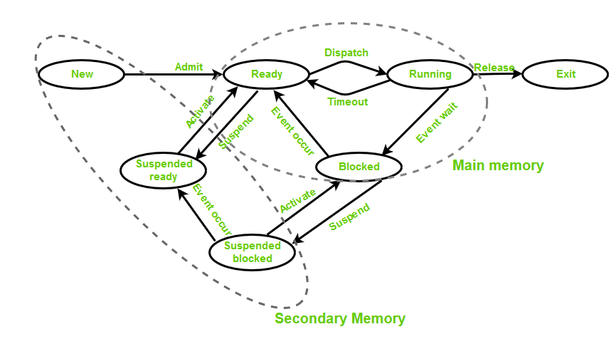
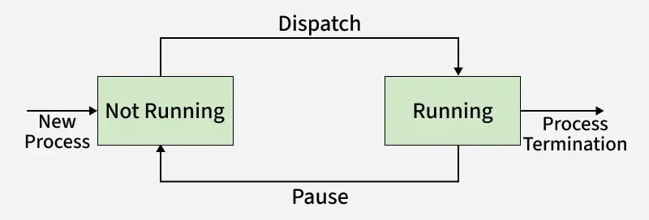
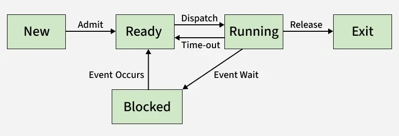

# Process and PCB (Process Management)

[← Back to Fundamentals](./README.md) · [↑ Operating Systems](../README.md)

This topic covers **process**, **Process Control Block (PCB)** / Process Table, and **states of a process** in an **OS-agnostic** way: no platform-specific commands or APIs.

---

## 1. Introduction of Process Management / Process in Operating System

### What is a process?

A **process** is an instance of a program that is being executed. Concretely, it is the combination of:

1. **Program code** (text) — The instructions that define what the process does.
2. **Current execution state** — Program counter (PC), processor registers, stack pointer. This is the “machine state” that must be saved and restored when the OS switches the CPU from one process to another.
3. **Address space** — The memory that the process can access: code, data, heap, stack. The kernel and the MMU ensure that one process cannot access another’s address space unless they explicitly share memory.
4. **Resources** — Open files, network connections, allocated devices, child processes, etc. The kernel tracks these so it can clean up when the process exits.

Important: **one program (one executable file) can correspond to many processes.** Each time you “run” the program, the OS creates a new process with its own PCB, address space, and resources.

---

## 2. Process Control Block (PCB) / Process Table

The **Process Control Block** (also called **task control block**, **process descriptor**, etc.) is the kernel data structure that holds everything the OS needs to manage the process. There is one PCB per process. Typical contents:

### Identification

- **Process ID (PID)** — Unique identifier (within the system or within a namespace).
- **Parent process ID (PPID)** — So the kernel can build a process tree and know whom to notify when a child exits.
- **User ID (UID), Group ID (GID)** — For ownership and permission checks.

### State and scheduling

- **Process state** — e.g. running, ready, blocked (waiting). The scheduler uses this to decide which process to run next.
- **Scheduling parameters** — Priority, nice value, policy (e.g. normal vs real-time), time slice remaining, CPU time used. Exact fields depend on the scheduler.
- **Pointers** — To place this process in scheduling queues (ready queue, wait queue for a certain resource).

### Memory management

- **Pointers to page tables** (or segment tables) — So the MMU can translate this process’s virtual addresses to physical addresses. When the kernel switches to this process, it loads the corresponding page-table base (e.g. into a control register).
- **Memory limits** — e.g. max heap size, per-process limits.

### I/O and resources

- **Open file descriptors** (or handles) — Pointers to kernel structures that represent open files, sockets, etc. When the process exits, the kernel closes all of them.
- **Current working directory**, root directory (for chroot-like isolation).
- **Other resource handles** — Semaphores, shared memory segments, etc., depending on the OS.

### Accounting and debugging

- **CPU time** (user and system), start time.
- **Pointers for debugging** — e.g. to support ptrace-style tools.

The PCB is the **single source of truth** for “this process.” When the process is not running, the CPU state (PC, registers) is also saved in the PCB (or in a kernel stack associated with it) so that when the process is scheduled again, the kernel can restore that state and resume execution.

---

## 3. States of a Process

A process moves through a set of **states**. The exact names and number of states vary by OS; the following is a standard model.

**States:**

| State | Meaning |
|-------|--------|
| **New** | The process is being created (PCB allocated, address space set up). Not yet ready to run. |
| **Ready** | The process has everything it needs to run except the CPU. It is in the **ready queue** waiting to be chosen by the scheduler. |
| **Running** | The process is currently executing on a CPU. (On a multi-CPU system, several processes can be “running” at once.) |
| **Waiting (blocked)** | The process cannot proceed until some event occurs (I/O completion, message arrival, lock acquired, child exit). It is in a **wait queue** (or several) and is **not** in the ready queue. |
| **Terminated** | The process has exited. Its PCB and resources may still exist until the parent has “reaped” it (e.g. wait()); the process is then a **zombie** until reaped. After reaping, the PCB is freed. |

**Typical transitions:**

- **New → Ready:** Kernel has finished creating the process and puts it in the ready queue.
- **Ready → Running:** Scheduler selects this process; dispatcher switches the CPU to it (context switch).
- **Running → Ready:** Process has used its time slice (preemptive scheduling) or yields; kernel puts it back in ready queue.
- **Running → Waiting:** Process requests something that blocks (e.g. read from disk, wait for child); kernel moves it to the appropriate wait queue.
- **Waiting → Ready:** The event the process was waiting for occurs; kernel moves it to the ready queue.
- **Running → Terminated:** Process exits (e.g. exit() or killed by signal); kernel moves it to terminated (zombie until reaped).

The diagram below shows process state transitions (two-state and multi-state models).

*Image: [States of a Process in Operating Systems](https://www.geeksforgeeks.org/operating-systems/states-of-a-process-in-operating-systems/).*

The **five-state model** (New, Ready, Running, Blocked/Waiting, Exit) is common; the figure below illustrates the five-state lifecycle.

*Image: [States of a Process in Operating Systems](https://www.geeksforgeeks.org/operating-systems/states-of-a-process-in-operating-systems/).*

The **seven-state model** adds Suspend Ready and Suspend Blocked (processes swapped out of main memory); the diagram below illustrates it.

*Image: [States of a Process in Operating Systems](https://www.geeksforgeeks.org/operating-systems/states-of-a-process-in-operating-systems/).*

No transition goes directly from **Waiting** to **Running**. A process that becomes ready must wait in the ready queue until the scheduler picks it. This separation (wait queues vs ready queue) is fundamental to how the kernel manages blocking and scheduling.

---

## Context switch

When the kernel decides to stop running process A and start running process B, it must:

1. **Save A’s context** — CPU state (PC, general-purpose registers, status register, maybe FPU state) into A’s PCB (or kernel stack). This is “saving the context” of A.
2. **Restore B’s context** — Load B’s saved context from B’s PCB into the CPU. The PC now points into B’s code; B’s stack pointer, etc., are restored.
3. **Switch address space** — Load the MMU registers (e.g. page-table base) for B so that memory references are to B’s address space. (On some systems this is part of “restore B’s context.”)
4. **Resume execution** — The CPU is now executing B. A is no longer running; it is in Ready or Waiting according to why the switch happened.

The **dispatcher** is the kernel code that performs this switch. The **cost** of a context switch includes: saving/restoring registers, flushing TLB (or tagging TLBs with address-space IDs), and lost cache locality. So the scheduler tries to balance responsiveness (switch often enough) with efficiency (not switch too often).

**Voluntary vs involuntary switch:**

- **Voluntary:** The running process gives up the CPU by making a **blocking** system call (e.g. read() that waits for I/O). The kernel puts it in Waiting and chooses another process from Ready.
- **Involuntary (preemptive):** The kernel takes the CPU away (e.g. on a timer interrupt). The process is moved to Ready; the kernel chooses another process. The process did not ask to stop; this is **preemption**.

---

## Process creation and termination

**Creation:** The kernel creates a new process by:

1. Allocating a new PCB.
2. Allocating (or sharing) an address space. Often the new process is a **copy** of the parent (fork-style): same code and data at first, then the child may load a different program (exec-style).
3. Setting up resources (e.g. copying or sharing file descriptors).
4. Initializing the PCB (state = Ready, PC at entry point, etc.) and putting the process in the ready queue.

The exact API (fork+exec vs CreateProcess vs spawn) is OS-specific; the *concept* is “new PCB, new or copied address space, new or shared resources.”

**Termination:** When a process exits:

1. The kernel marks it Terminated (zombie). It may release most resources (memory, files) but keeps a minimal record (exit status) in the PCB.
2. The parent can **wait** (e.g. wait()) to “reap” the child: the kernel returns the exit status and then **frees the child’s PCB**. Until then, the child remains a zombie.
3. If the parent exits before reaping, the kernel may **reparent** the zombie to a designated process (e.g. init, PID 1), which is responsible for reaping.

---

## Summary

- A **process** is a program in execution: code + current CPU state + address space + resources. The kernel represents it with a **Process Control Block (PCB)**.
- The **PCB** holds: identity (PID, PPID, UID), state, scheduling info, memory-management info (page tables), open files and other resources, accounting. When the process is not running, its CPU state is saved in the PCB.
- **States:** New → Ready ⇄ Running → Waiting → (back to Ready) → Terminated. Ready = “can run, waiting for CPU”; Waiting = “blocked on an event.”
- **Context switch:** Save current process’s context, restore another’s, switch address space, resume. Done by the **dispatcher**; can be voluntary (blocking call) or involuntary (preemption).
- **Creation:** New PCB, new/copied address space, resources. **Termination:** Process exits; PCB stays as zombie until parent reaps.

All of this is **operating system basics** — independent of whether the OS is Linux, Windows, or another. How a particular OS implements PCBs, state names, and system calls is covered in the [Linux](../Linux/README.md) and [Windows](../Windows/README.md) sections.

---

## Further reading

- [Introduction of Process Management](https://www.geeksforgeeks.org/operating-systems/introduction-of-process-management/)
- [Process in Operating System](https://www.geeksforgeeks.org/operating-systems/process-in-operating-system/)
- [Process Control Block (PCB)](https://www.geeksforgeeks.org/operating-systems/process-control-block-in-os/)
- [States of a Process](https://www.geeksforgeeks.org/operating-systems/states-of-a-process-in-operating-systems/)
- [Process Creation and Deletions](https://www.geeksforgeeks.org/operating-systems/process-creation-and-deletions-in-operating-systems/)
- [Context Switch in Operating System](https://www.geeksforgeeks.org/operating-systems/context-switch-in-operating-system/)
- [Process Schedulers](https://www.geeksforgeeks.org/operating-systems/process-schedulers-in-operating-system/)
