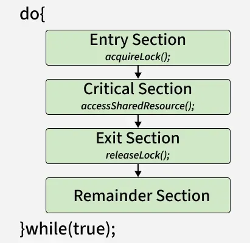

# Process synchronization

[← Back to Fundamentals](./README.md) · [↑ Operating Systems](../README.md)

This topic covers **race condition**, **critical section**, solutions (hardware and software), **semaphores**, **mutex vs semaphore**, **monitors**, and classical IPC problems — **OS-agnostic** (no platform-specific APIs).

---

## 1. Introduction: Race condition and Critical section

- **Critical section** — A segment of code that accesses **shared resources** (variables, data structures, devices). Only one process (or thread) should be executing its critical section at a time for that resource.
- **Race condition** — When two or more processes execute their critical sections concurrently (or interleaved) and the result depends on the **order** of their execution. The outcome is then non-deterministic and often wrong (e.g. lost update, corrupted data).

**Goal:** Ensure **mutual exclusion** — at any time, at most one process is in the critical section for a given resource.

*Image: [Critical Section in Synchronization](https://www.geeksforgeeks.org/operating-systems/critical-section-in-synchronization/).*

---

## 2. Requirements for a correct solution

A solution to the critical-section problem should satisfy:

1. **Mutual exclusion** — No two processes are in their critical sections at the same time (for the same resource).
2. **Progress** — If no process is in the critical section and some processes want to enter, then one of them will eventually enter. The system as a whole keeps making progress.
3. **Bounded waiting** — After a process has requested to enter its critical section, there is a bound on how many other processes may enter before it does. So no **starvation**: no process waits forever.

(Some treatments also include “no assumption about relative speeds of processes” and “no busy-waiting” as desirable.)

---

## 3. Hardware-based solutions (and software: Peterson's, Dekker's, Bakery)

Implementing mutual exclusion correctly with only shared memory and no special instructions is possible (e.g. Peterson’s algorithm, Dekker’s algorithm) but complex and often inefficient. In practice, the OS and hardware provide primitives.

### Test-and-Set (atomic read-modify-write)

- A single **atomic** instruction that (1) reads a memory location, (2) writes a value (e.g. 1) to it, and (3) returns the **old** value. If the old value was 0, the process “wins” the lock; if 1, another process holds it, so this process retries or blocks.
- Used to build **spinlocks**: a process repeatedly test-and-sets until it gets 0 (acquires the lock). Simple but **busy-waits** (consumes CPU). Often used only for very short critical sections or inside the kernel.

### Compare-and-Swap (CAS)

- Atomic instruction: compare a memory location to an expected value; if equal, write a new value and return success; otherwise return failure. Used for **lock-free** data structures and for building locks and semaphores.
- Similar in spirit to test-and-set: atomic read-modify-write that the OS or runtime uses to implement higher-level primitives.

### Disabling interrupts

- On a uniprocessor, the kernel can disable interrupts before entering a critical section and re-enable after leaving. No other process can run (no preemption), so no race. **Does not work** on multiprocessors (other CPUs can still run). Used only in limited kernel contexts, not as a general solution.

---

## 4. Semaphores

A **semaphore** is an integer variable (or a more complex structure) that the OS maintains and that processes access only through two **atomic** operations, traditionally called **P** (wait, decrement) and **V** (signal, increment).

- **P(s):** If `s > 0`, decrement `s` and continue. If `s == 0`, **block** the process (put it in a wait queue associated with this semaphore) until `s` becomes positive (when another process does V). When the process is unblocked, it decrements `s` and continues.
- **V(s):** Increment `s`. If one or more processes are blocked on this semaphore, **wake one** of them (and that process will then decrement `s` and proceed).

**Binary semaphore:** `s` is only 0 or 1. Used for **mutual exclusion**: before entering the critical section, do P(s); after leaving, do V(s). Only one process can have “ownership” at a time.

**Counting semaphore:** `s` can be any nonnegative integer. Represents the number of **available resources** (e.g. free buffer slots). P(s) = “acquire one resource” (block if none); V(s) = “release one resource.”

The OS implements P and V in the kernel (or in a runtime that uses atomic instructions and system calls) so that the check-and-block and the wake-up are **atomic** with respect to other P/V operations. Semaphores are a fundamental building block for synchronization; mutexes and monitors can be implemented with them (or with similar primitives).

---

## 5. Mutex vs Semaphore

A **mutex** (or **lock**) is a synchronization primitive that provides **mutual exclusion**. Typically:

- **Lock (acquire):** Before entering the critical section, the process **locks** the mutex. If the mutex is already held by another process, the caller **blocks** until the mutex is released.
- **Unlock (release):** After leaving the critical section, the process **unlocks** the mutex. If processes are waiting, one is woken and acquires the mutex.

Difference from a binary semaphore (in typical usage): a **mutex** often has a notion of **ownership** — only the process that locked it may unlock it. This allows the OS to prevent “wrong” unlocks and to support features like priority inheritance (to avoid priority inversion). A **semaphore** has no owner; any process can do V. So: use a **mutex** for “one at a time” critical sections; use a **semaphore** when you need counting or when a different process must release (e.g. signaling).

---

## 6. Monitors

A **monitor** is a higher-level language construct that combines:

- **Mutual exclusion** — Only one process can be executing inside the monitor’s procedures at a time (like an implicit mutex around the monitor body).
- **Condition variables** — For waiting and signaling. A process that needs to wait (e.g. “buffer empty”) does **wait(cond)** on a condition variable; it leaves the monitor (releases the lock) and blocks. Another process that makes the condition true (e.g. “I added an item”) does **signal(cond)** to wake one waiter (or **broadcast** to wake all). The woken process re-acquires the monitor lock and continues.

Monitors are often implemented using mutexes and condition variables (or semaphores) underneath. They simplify reasoning about synchronization by encapsulating shared state and the operations on it in one place.

---

## 7. Classical IPC problems

These illustrate how to use the primitives above.

### Producer–consumer (bounded buffer)

- **Producers** add items to a shared buffer; **consumers** remove items. The buffer has finite capacity. Producers must block when the buffer is **full**; consumers must block when it is **empty**.
- **Solution:** One mutex (or binary semaphore) for mutual exclusion on the buffer. Two counting semaphores: **empty** = number of free slots (initially N); **full** = number of filled slots (initially 0). Producer: P(empty), P(mutex), add item, V(mutex), V(full). Consumer: P(full), P(mutex), remove item, V(mutex), V(empty).

### Readers–writers

- Many **readers** can access the data concurrently; **writers** need exclusive access. Variants: **reader-preference** (readers can starve writers); **writer-preference** (writers can starve readers); **fair** (no starvation).
- **Solution:** Typically a mutex for “writing” and a counter (plus mutex for the counter) for readers. When the first reader enters, it locks “writing”; when the last reader leaves, it unlocks. Writers always lock “writing.” Fairness requires extra logic (e.g. a queue or additional semaphores).

### Dining philosophers

- N philosophers, N forks (or chopsticks). Each philosopher needs **two** forks to eat. If each picks up one fork and waits for the other, **deadlock** can occur (everyone holds one fork, everyone waits).
- **Solutions:** Impose an **order** on forks (e.g. always take the lower-numbered fork first) to break circular wait; or use a **semaphore** that allows at most N-1 philosophers to try to eat at once; or use **try-lock** (non-blocking) and back off if the second fork is not available.

---

## 8. Inter-Process Communication (IPC) — concepts

Processes (and sometimes threads) need to **communicate** or **share data**. Main approaches:

- **Shared memory** — A region of memory is mapped into the address spaces of two or more processes. They read/write the same bytes. **Synchronization** (mutex, semaphore) is required to avoid race conditions. Fast; no copy.
- **Message passing** — One process sends a message; another receives it. Data is **copied** (or passed by reference in controlled ways). No shared memory needed; the kernel (or runtime) handles buffering and delivery. Can be blocking (send blocks until received) or non-blocking; can be over channels (pipes, sockets) or mailboxes.
- **Signals / events** — Simple notification (e.g. “child exited,” “timer expired”). Not for bulk data; for coordination and exception-like handling.
- **Pipes / FIFOs** — Unidirectional byte stream; one process writes, another reads. The kernel buffers. Often used in shells (e.g. `cmd1 | cmd2`).

The choice depends on performance (shared memory vs copy), complexity, and whether the OS provides shared memory or only message passing (e.g. some microkernels push everything to message passing).

---

## Summary

- **Critical section** = code that uses shared resources. **Race condition** = unsynchronized concurrent access; outcome is wrong or non-deterministic. **Mutual exclusion** = at most one process in the critical section at a time.
- A correct solution must provide **mutual exclusion**, **progress**, and **bounded waiting**.
- **Hardware:** Test-and-Set, Compare-and-Swap (atomic read-modify-write) used to build locks and semaphores. Disabling interrupts is a uniprocessor kernel trick only.
- **Semaphores:** P (wait, block if 0) and V (signal, wake one). Binary for mutual exclusion; counting for resource counts.
- **Mutex** = lock with ownership; **semaphore** = no owner, good for counting and signaling.
- **Monitor** = mutual exclusion + condition variables for waiting/signaling; language-level construct.
- **Classical problems:** Producer–consumer (empty/full semaphores); readers–writers (reader count + write lock); dining philosophers (ordering or try-lock to avoid deadlock).
- **IPC:** shared memory + synchronization; message passing; signals; pipes. All are **OS-agnostic** concepts; actual APIs are OS-specific (see [Linux](../Linux/README.md) and [Windows](../Windows/README.md)).

---

## Further reading

- [Introduction to Process Synchronization](https://www.geeksforgeeks.org/operating-systems/introduction-of-process-synchronization/)
- [Race Condition](https://www.geeksforgeeks.org/operating-systems/race-condition-in-operating-systems/)
- [Critical Section](https://www.geeksforgeeks.org/operating-systems/critical-section-in-synchronization/)
- [Solutions to Critical Section Problem](https://www.geeksforgeeks.org/operating-systems/solutions-to-critical-section-problem/)
- [Semaphores](https://www.geeksforgeeks.org/operating-systems/semaphores-in-process-synchronization/)
- [Mutex vs Semaphore](https://www.geeksforgeeks.org/operating-systems/mutex-vs-semaphore/)
- [Monitors](https://www.geeksforgeeks.org/operating-systems/monitors-in-process-synchronization/)
- [Classical IPC Problems](https://www.geeksforgeeks.org/operating-systems/classical-ipc-problems/)
- [Inter Process Communication (IPC)](https://www.geeksforgeeks.org/operating-systems/inter-process-communication-ipc/)
