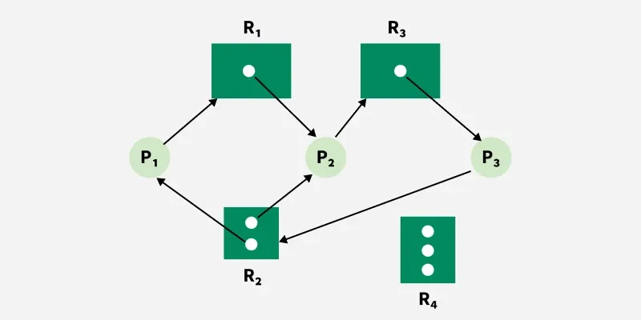

# Deadlock

[← Back to Fundamentals](./README.md) · [↑ Operating Systems](../README.md)

This topic covers **deadlock**: the four conditions, **Resource Allocation Graph (RAG)**, prevention, avoidance (Banker's algorithm), detection, recovery, and the distinction from starvation and livelock — **OS-agnostic**.

---

## 1. Introduction of Deadlock

**Deadlock** — A set of processes is in a **deadlock** state if every process in the set is waiting for an event or resource that can be caused only by another process in the set. None of them can ever proceed.

Simple example: Process A holds resource R1 and waits for R2; Process B holds R2 and waits for R1. Both wait forever.

Deadlock is a **global** property of the system (or of a subset of processes and resources), not a property of a single process. The OS (or the application, if it manages its own locks) must either **prevent** deadlock, **avoid** it (grant resources only when “safe”), **detect** it when it occurs and **recover**, or ignore it (some systems assume it is rare and reboot or kill when the system hangs).

---

## 2. Four necessary conditions (Coffman conditions)

For deadlock to be **possible**, all four of the following must hold. If we **break any one** of them, deadlock cannot occur (so we can **prevent** deadlock by design).

| Condition | Meaning |
|-----------|---------|
| **Mutual exclusion** | At least one resource is **non-shareable**: only one process can hold it at a time. (If all resources were shareable, no one would “wait” for exclusive access.) |
| **Hold and wait** | A process can hold some resources while **waiting** for additional resources. So it does not release what it has before asking for more. |
| **No preemption** | Resources cannot be **forcibly taken away** from a process. The process holds them until it voluntarily releases. (If we could preempt resources, we could break a cycle by taking a resource from one process and giving it to another.) |
| **Circular wait** | There exists a **cycle** in the “wait-for” relation: e.g. P1 waits for P2, P2 waits for P3, …, Pn waits for P1. So every process in the cycle is waiting for another in the cycle. |

So: **Deadlock ⇒ all four conditions hold.** To **prevent** deadlock, we ensure at least one condition is always false.

---

## 3. Deadlock vs Starvation vs Livelock

| Term | Meaning |
|------|---------|
| **Deadlock** | A set of processes are **blocked forever**, each waiting only on others in the set. No one can make progress. |
| **Starvation** | A process is **never (or rarely)** chosen to run or to get a resource, even though the system as a whole is making progress. Others keep “winning.” (E.g. low-priority process never gets the CPU; or a process never acquires a lock because others always get it first.) |
| **Livelock** | Processes keep **changing state** but make **no real progress**. (E.g. two processes each yield to the other repeatedly; or two processes in a corridor keep stepping aside in the same direction.) Not blocked, but not advancing either. |

---

## 4. Resource Allocation Graph (RAG)

The **Resource Allocation Graph** is a directed graph used to model who holds what and who wants what.

- **Nodes:** **Process** nodes (e.g. circles) and **Resource** nodes (e.g. rectangles; sometimes with **dots** inside to denote the number of **instances** of that resource type).
- **Request edge:** Process → Resource (process is **waiting** for one instance of that resource).
- **Assignment edge:** Resource → Process (one instance of that resource is **assigned** to that process).

*Image: [Resource Allocation Graph (RAG) in Operating System](https://www.geeksforgeeks.org/operating-systems/resource-allocation-graph-rag-in-operating-system/).*

**Single-instance resources:** If the graph has a **cycle**, then deadlock **has occurred** (all four conditions are satisfied for the processes and resources in the cycle).

**Multi-instance resources:** A cycle is **necessary** but not **sufficient** for deadlock. Deadlock exists only if the cycle cannot be “broken” by granting resources (i.e. the system cannot satisfy all requests even in the future). The **Banker’s algorithm** (avoidance) uses a more precise notion of “safe state” for multi-instance resources.

---

## 5. Deadlock Prevention

We **design** the system so that one of the four conditions **never** holds.

| Condition to break | How |
|--------------------|-----|
| **Mutual exclusion** | Make all resources shareable. Often not possible (e.g. a printer cannot be shared by two processes at once in the same way). |
| **Hold and wait** | Require processes to **request all** resources they will ever need **up front** (before starting). If any is unavailable, the process waits without holding anything. Con: poor resource utilization; processes may hold resources they do not need yet for a long time. Alternatively: release all before requesting new ones (still restrictive). |
| **No preemption** | If a process holding resources requests another resource and cannot get it, **preempt** (take away) all resources it holds. The process is rolled back or restarted. Used for some resources (e.g. CPU, memory) but not for others (e.g. printer). |
| **Circular wait** | Impose a **total ordering** on resource types (e.g. R1 < R2 < R3). Require that every process requests resources only in **increasing** order. Then the wait-for graph can never have a cycle (no “P1 waits for P2 and P2 waits for P1” for the same resource type). This is the most **practical** prevention method in software (lock ordering). |

---

## Deadlock avoidance (Banker’s algorithm)

**Idea:** Before **granting** a resource request, check whether the resulting state would be **safe**. A state is **safe** if there exists a **sequence** of process executions (each process eventually gets all it needs, runs, and releases) such that all processes can **finish**. Grant the request only if the new state is safe; otherwise, make the process **wait**.

**Banker’s algorithm** (for multiple resource types, each with a fixed number of instances):

- Each process declares its **maximum** need for each resource type (worst case).
- The algorithm maintains: **Available** (free instances per type), **Allocation** (what each process holds), **Need** (max − allocation for each process).
- **Safety algorithm:** Look for a process whose **Need** is ≤ **Available** (in vector sense). Assume it runs to completion and releases all; update Available. Repeat. If all processes can be “finished” in some order, the state is **safe**.
- **Resource-request algorithm:** When a process requests resources, pretend to grant them (update Allocation, Available, Need). Run the safety algorithm. If the new state is safe, grant the request; otherwise, block the process (do not grant).

**Limitations:** Requires knowing **maximum** need in advance; processes may be blocked even when deadlock would not actually occur (conservative); overhead of running the algorithm on every request.

---

## 7. Deadlock Detection and Recovery

**Detection:** Build the **wait-for** graph (who is waiting for whom, or who is waiting for which resource held by whom). If there is a **cycle**, deadlock exists. Run the detection algorithm **periodically** or when a process blocks (depending on policy).

**Recovery:** Once deadlock is detected, break it.

- **Abort one or more deadlocked processes** — Choose a victim (e.g. one that has done the least work, or one that can be restarted). Terminate it and release all its resources. Other processes may then proceed. The victim may need to be restarted later.
- **Resource preemption** — Take a resource away from a process (roll back the process to a previous state, or retry). Give the resource to a waiting process. Complex: we must ensure the preempted process can recover (rollback, checkpoints) and avoid starvation (how many times we preempt the same process).

---

## Summary

- **Deadlock** = set of processes, each waiting only on another in the set; no one can proceed.
- **Four necessary conditions:** mutual exclusion, hold and wait, no preemption, circular wait. Break **one** to **prevent** deadlock; **circular wait** is often broken by **resource ordering**.
- **RAG** models allocation and request; a **cycle** in the graph (for single-instance resources) means deadlock. For multi-instance, safety is checked with something like the Banker’s algorithm.
- **Prevention:** design so one condition never holds (ordering is most practical).
- **Avoidance:** grant only if state stays **safe** (Banker’s algorithm); need max claims in advance.
- **Detection:** build wait-for graph; cycle ⇒ deadlock. **Recovery:** abort process(es) or preempt resources.

This is **operating system basics**. How a particular OS or runtime handles deadlock (e.g. lock ordering in kernel code, timeouts in user space) is implementation detail (see [Linux](../Linux/README.md) and [Windows](../Windows/README.md)).

---

## Further reading

- [Introduction of Deadlock](https://www.geeksforgeeks.org/operating-systems/introduction-of-deadlock-in-operating-system/)
- [Handling Deadlocks](https://www.geeksforgeeks.org/operating-systems/handling-deadlocks/)
- [Deadlock Prevention](https://www.geeksforgeeks.org/operating-systems/deadlock-prevention/)
- [Banker’s Algorithm](https://www.geeksforgeeks.org/operating-systems/bankers-algorithm-in-operating-system-2/)
- [Deadlock Detection and Recovery](https://www.geeksforgeeks.org/operating-systems/deadlock-detection-recovery/)
- [Deadlock, Starvation, Livelock](https://www.geeksforgeeks.org/operating-systems/deadlock-starvation-and-livelock/)
- [Resource Allocation Graph (RAG)](https://www.geeksforgeeks.org/operating-systems/resource-allocation-graph-rag-in-operating-system/)
