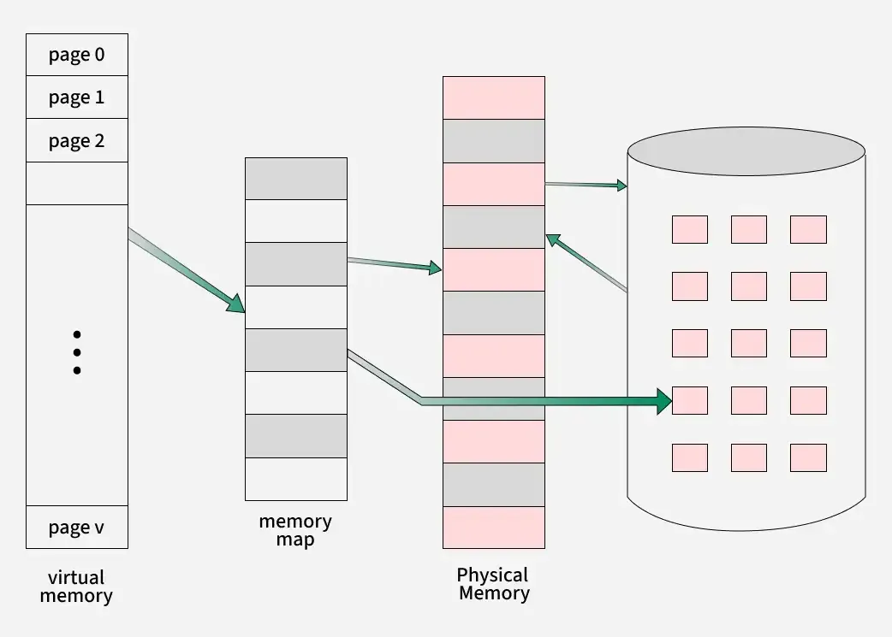
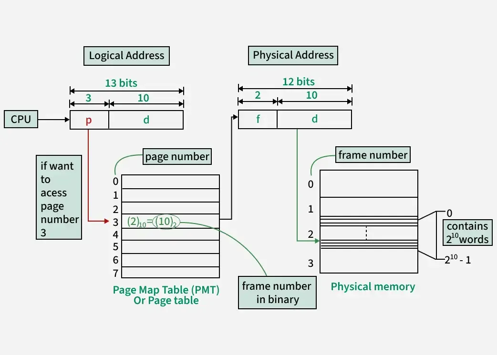
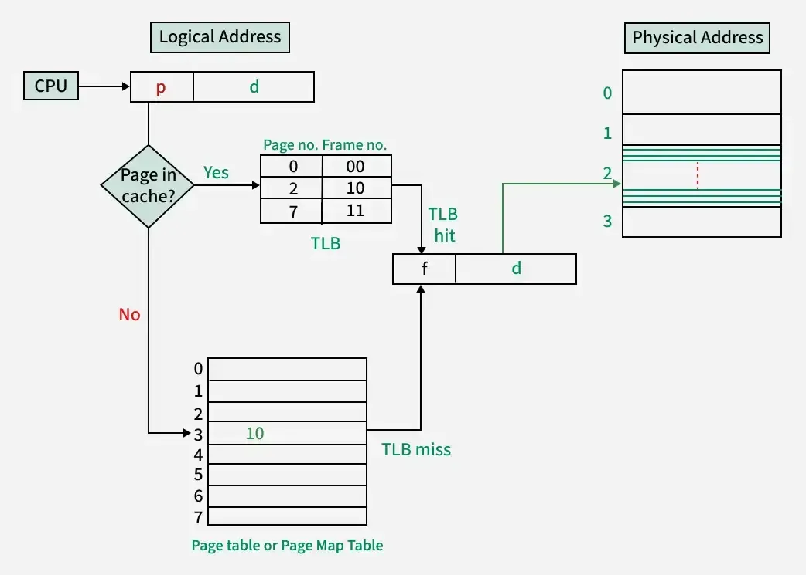

# Memory management

[← Back to Fundamentals](./README.md) · [↑ Operating Systems](../README.md)

This topic covers **memory management**: logical vs physical address, memory hierarchy, contiguous and non-contiguous allocation (paging, segmentation), virtual memory, page replacement, and thrashing — **OS-agnostic**.

---

## 1. Memory Management basics: Logical (virtual) vs physical address

- **Logical address** (virtual address) — Generated by the CPU when a process runs (instruction fetch, load/store). It is the address the **program** uses. Each process has its **own** address space (e.g. 0 to 2^32 − 1), so the same logical address in two processes refers to different physical locations (or is invalid in one of them).
- **Physical address** — The address in **actual RAM** (or in a frame that backs a page). The **Memory Management Unit (MMU)** translates logical → physical using structures (page tables, segment tables) set up by the kernel.

The kernel sets up **one set of mappings per process** (e.g. one page table per process). When the kernel switches the CPU to another process, it loads the **page-table base** (and related registers) for that process so that all logical addresses are translated using *that* process’s mappings. This gives **isolation**: one process cannot access another’s memory unless they explicitly share pages.

---

### Memory units and hierarchy (anatomy of memory)

Memory in a system is organized in a **hierarchy**:

- **Registers** — Inside the CPU; fastest; very small.
- **Caches (L1, L2, L3)** — On-chip or nearby; hold copies of recently used code and data; faster than main memory.
- **Main memory (RAM)** — Physical memory that the OS and MMU manage. All running code and data must ultimately be backed by RAM (or by something the OS treats like memory, e.g. memory-mapped I/O). RAM is **volatile** — lost on power-off.
- **Secondary storage (disk, SSD)** — Persistent; used for swap (virtual memory) and file systems. Much slower than RAM.

The OS is concerned with **main memory** and **secondary**: it allocates physical frames to processes, maps virtual pages to frames or to disk (swap), and uses the **page cache** to buffer file data in RAM. The **anatomy** of memory from the OS view is: physical address space (frames), virtual address spaces (per process), and the structures (page tables, swap) that connect them.



*Image: [Virtual Memory in Operating System](https://www.geeksforgeeks.org/operating-systems/virtual-memory-in-operating-system/).*

---

## Reading and writing from and to memory

When the CPU executes a **load** or **store** instruction:

1. It generates a **virtual (logical) address**.
2. The **MMU** translates it to a **physical address** using the current process’s page table (and TLB). If the page is not present or not permitted, the MMU raises a **page fault** or **protection fault**; the kernel handles it (e.g. load from swap, or kill the process).
3. The physical address is used to access **cache** or **main memory**. The hardware handles cache hit/miss and coherence.

The OS does not “read or write memory” for the process on every access. It sets up the **mappings** (page tables) and handles **faults** (page fault, copy-on-write). Normal reads and writes are done by the CPU and MMU; the OS intervenes only on faults and when allocating or freeing pages.

---

## DMA (Direct Memory Access)

**DMA** allows **devices** (e.g. disk controller, NIC) to read from or write to **main memory** **without** the CPU moving each byte. The CPU sets up a DMA transfer (source/destination address in memory, length, device) and can do other work while the device performs the transfer. When the transfer completes, the device raises an **interrupt**; the kernel’s interrupt handler notifies the process or updates kernel buffers.

**Why it matters for the OS:** Without DMA, the CPU would be busy copying data between device and memory (e.g. every disk block). With DMA, the CPU is free for other tasks; the OS must only ensure that the **memory** involved in the DMA transfer is **pinned** (not swapped out) and that the device uses the correct **physical** addresses (the kernel provides these when setting up the transfer). So the OS’s role is: allocate a buffer (often in a region that can be used for DMA), hand its physical address to the device, and handle the completion interrupt. This is part of **device management** and **I/O**; it is how the OS lets hardware move data efficiently without tying up the CPU.

---

## 2. Contiguous allocation (and fragmentation)

Early (and some simple) systems give each process **one contiguous** block of physical memory. Problems:

- **External fragmentation** — Free memory is scattered into many small holes; a new process may not fit in any single hole even though total free space is enough.
- **Internal fragmentation** — Wasted space inside an allocated block (e.g. process gets a multiple of a minimum block size and does not use all of it).

**Compaction** (moving processes to coalesce free space) is expensive. **Paging** and **segmentation** avoid or reduce these issues.

### Buddy system

The **buddy system** is a **contiguous** memory allocation technique that reduces **external fragmentation** by keeping free memory in blocks of power-of-two sizes. When the kernel needs a block of size *n*, it finds the smallest power-of-two block that is at least *n* (e.g. 2^k). If no such block is free, it **splits** a larger free block in half repeatedly until a block of the right size is created (each half is a "buddy" of the other). When a block is **freed**, the kernel checks whether its **buddy** (the adjacent block that was split from the same parent) is also free; if so, it **merges** them back into one larger block. So allocation may **split**; deallocation may **coalesce** with the buddy. The OS maintains free lists for each size 2^0, 2^1, 2^2, … . This gives predictable block sizes and fast coalescing, and is often used for **kernel** memory (e.g. Linux’s physical page allocator uses a buddy variant). It is **OS-agnostic** as a concept: a way to manage contiguous physical memory with less fragmentation.

```
  Buddy system (simplified): block size 2^k, split/merge with buddy

  Allocate request for size 2^1 (e.g. 2 units):
  Free list had one block of 2^3. Split repeatedly:
      [  2^3 free  ]  →  [ 2^2 ][ 2^2 ]  →  [ 2^1 ][ 2^1 ][ 2^2 ]
                              ↑ one 2^1 allocated; rest stay free
  When that 2^1 is freed: check buddy (other 2^1). If free, merge:
      [ 2^1 ][ 2^1 ]  →  [    2^2    ]   (coalesce)
  Then check if buddy of that 2^2 is free; if so, merge to 2^3, etc.
```

### Overlays

**Overlays** are a **program-controlled** technique (not the same as paging) where **different parts of a program** use the **same region of memory** at different times. The program (or a loader) is divided into **overlay segments**; only some of them are in memory at once. When the program needs a segment that is not loaded, it **loads** it from disk **over** the memory previously used by another overlay. So the same logical addresses are reused for different code/data at different times. Overlays were common when **physical memory was very small** and the OS did not provide virtual memory; the **programmer or linker** had to decide the overlay structure. Modern systems rely on **virtual memory** and **demand paging** instead, so the OS loads pages on demand and the programmer does not manage overlays by hand. Overlays remain a **fundamental** idea: reusing the same physical memory for different logical content over time.

```
  Overlays: same physical region reused for different segments over time

  Memory (fixed size):     [    Overlay region   ]
  Time 1: load overlay A   [  Segment A (code)   ]  ← program runs A
  Time 2: need B, load     [  Segment B (code)   ]  ← B overwrites A
  Time 3: need A again     [  Segment A (code)   ]  ← load A from disk again
  Program controls when to load which segment; OS or loader does the load.
```

---

## 3. Non-contiguous: Paging



*Image: [Paging in Operating System](https://www.geeksforgeeks.org/operating-systems/paging-in-operating-system/).*



*Image: [Paging in Operating System](https://www.geeksforgeeks.org/operating-systems/paging-in-operating-system/) (page table and TLB).*

**Idea:** Physical memory is divided into fixed-size **frames**. Each process’s logical address space is divided into fixed-size **pages** (same size as a frame, e.g. 4 KB). The kernel maintains a **page table** for each process: it maps each **virtual page number (VPN)** to a **physical frame number (PFN)** (or marks the page as invalid / not present / on disk).

- **Address split:** A logical address is split into **page number** (index into page table) and **page offset** (offset within the page). The offset is the same in physical address; the frame number comes from the page table.
- **No external fragmentation** — Any free frame can hold any page. **Internal fragmentation** — At most one page per allocation unit (e.g. a 1-byte allocation still uses one page).
- **Page table** — Stored in kernel memory (or partly in hardware). Each entry (PTE) contains: frame number (or “not present”), permission bits (read, write, execute), and flags (e.g. accessed, dirty for write-back).
- **TLB (Translation Lookaside Buffer)** — Hardware cache of VPN → PFN. On a TLB hit, translation is fast; on a TLB miss, the kernel (or hardware) walks the page table and fills the TLB. On a context switch, the TLB may be flushed (or entries tagged with an address-space ID) so that the new process does not use the old process’s translations.

### Paging vs swapping

- **Paging** — Memory is divided into **fixed-size pages** (and frames). The OS maps **virtual pages** to **physical frames**; some pages may be **on disk** (in swap) and loaded on **page fault**. Paging is the **memory management scheme** (address space layout, page tables, demand paging, page replacement). "Paging" is also used to mean moving a page to/from disk (e.g. "page out" = evict a page to swap).
- **Swapping** — Historically, **swapping** meant moving an **entire process** (all of its address space) between main memory and disk. The process is either **in memory** (runnable) or **on disk** (suspended). So swapping is **whole-process**; paging is **page-level**. In modern usage, "swap" often refers to the **swap area** (disk space for evicted pages) and "swapping" to moving **pages** to/from that area — so "paging" and "swapping" (for pages) overlap. The **fundamental** distinction: **process swapping** = whole process in/out; **paging** = individual pages in/out (with or without a swap area).

```
  Process swapping (whole process):     Paging (page-level):
  ┌─────────────┐     ┌─────────────┐   Process has many pages;
  │   Memory    │     │    Disk     │   some in RAM, some on disk.
  │  [Process P] │◄───►│  [Process P] │   ┌─────────┐     ┌─────────┐
  │  (all of P) │     │  (all of P)  │   │  RAM    │     │  Swap   │
  └─────────────┘     └─────────────┘   │ [p1][p2]│◄───►│ [p3][p4]│
  P either in memory or on disk;        │  (frames)│     │ (pages) │
  no mix.                               └─────────┘     └─────────┘
                                        One process; pages move in/out.
```

### Page tables in more depth

The **page table** is a per-process structure. For each **virtual page number (VPN)**, the corresponding **page table entry (PTE)** holds:

- **Physical frame number (PFN)** — Which frame in RAM (if present), or a placeholder for “not present” / “on disk.”
- **Present bit** — Is this page in physical memory? If not, access causes a **page fault**; the kernel loads the page (and may evict another).
- **Read / Write / Execute bits** — Permissions. Violations cause a **protection fault**.
- **Accessed bit** — Set by hardware when the page is read or written. Used by the OS for page replacement (e.g. approximate LRU).
- **Dirty bit** — Set when the page is written. If the page is evicted, the kernel must **write it back** to swap (or to its backing store) if dirty.

For large address spaces, the page table itself can be huge (one PTE per page). So many systems use **multilevel page tables**: the virtual address is split into multiple indices (e.g. level-1 index, level-2 index, offset). Only the parts of the table that are actually used are allocated. The MMU (or the kernel on a TLB miss) walks these levels to find the final PTE. This is the **page table structure** the OS designs and the hardware (or software) walks on each translation.

---

## 4. Segmentation

**Idea:** The address space is divided into **segments** (e.g. code, data, stack) of **variable** size. Each segment has a **base** and **limit** (or base and length). A logical address is (segment number, offset). The kernel (or MMU) checks offset < limit and computes physical address = base + offset.

- **Pros:** Matches program structure; easy to share segments (e.g. shared library as one segment); protection per segment (e.g. code read-only).
- **Cons:** **External fragmentation** (variable-size segments leave holes). **Segmentation with paging:** Each segment is itself paged (segment base points to a page table, etc.); combines sharing and structure with the benefits of paging.

### Paging vs segmentation (comparison)

| Aspect | Paging | Segmentation |
|--------|--------|----------------|
| **Unit of allocation** | Fixed-size **pages** (e.g. 4 KB). | Variable-size **segments** (e.g. code, data, stack). |
| **Address** | Logical address = **page number** + **page offset**. | Logical address = **segment number** + **offset within segment**. |
| **Fragmentation** | **No external** (any free frame holds any page); **internal** (last page of a region may be partly unused). | **External** (variable-size segments leave holes); **no internal** within a segment. |
| **Sharing** | Share by mapping the same **frame** into multiple processes’ page tables. | Share by mapping the same **segment** (base, limit) into multiple processes. |
| **Protection** | Per-**page** (read/write/execute bits in PTE). | Per-**segment** (e.g. code segment read-only, stack read-write). |
| **Visibility to programmer** | **Transparent**: programmer sees a flat address space; OS/hardware split into pages. | **Visible** in some designs: segment number is explicit (e.g. code vs data vs stack). |
| **Typical use** | Dominant in **modern** general-purpose OSs (e.g. x86-64, ARM: flat virtual space implemented with paging). | Used in **combined** form (segmentation with paging) or in older/embedded systems; pure segmentation is rare. |

So: **paging** = fixed-size units, no external fragmentation, hardware-friendly; **segmentation** = variable-size units that match program structure, but external fragmentation and more complex placement. Many systems use **paging** as the main mechanism and **segments** only as a logical organization (e.g. code/data/BSS/stack regions) implemented on top of paging.

---

## 5. Virtual memory (demand paging)

**Virtual memory** means the total **virtual** address space of all processes can be **larger** than physical RAM. Some pages of a process reside in **physical frames**; others may be **not present** (invalid) or **on disk** (swap).

- **Demand paging:** Pages are **loaded** into memory only when they are **first accessed** (lazy loading). When the process touches a page that is not in RAM, the CPU raises a **page fault**. The kernel’s page-fault handler: (1) finds the page (e.g. in swap or in the executable), (2) allocates a free frame (or evicts a page to free one), (3) loads the page into the frame, (4) updates the page table, (5) resumes the process. The process retries the access and now succeeds.
- **Benefits:** Processes can run with only a subset of their pages in RAM (reduces RAM requirement); simplifies loading (no need to load the whole program at once); isolation (each process has its own mappings).

---

## 6. Page replacement algorithms

When a **page fault** occurs and **no free frame** exists, the kernel must **evict** a page (the “victim”) from a frame: write it back to disk if it is **dirty** (modified), then free the frame and use it for the faulting page. The **page replacement algorithm** chooses the victim. Goals: minimize **page fault rate**; avoid removing pages that will be used again soon.

| Algorithm | Idea | Notes |
|-----------|------|--------|
| **FIFO** | Evict the page that has been in memory the **longest**. | Simple; can suffer **Belady’s anomaly** (more frames → more faults). |
| **Optimal (MIN)** | Evict the page that will be **used farthest in the future**. | Not implementable (requires knowing the future); used as a benchmark. |
| **LRU (Least Recently Used)** | Evict the page that has not been used for the **longest** time. | Good in practice; expensive to implement exactly (need to track order of use). |
| **Clock (Second Chance)** | Approximate LRU: each page has a **reference bit**. Pages in a circular list; on eviction need, sweep: if reference bit = 1, set to 0 and skip; if 0, evict. | Practical; **reference bit** can be set by hardware on access. |
| **Enhanced Clock** | Add a **modified (dirty)** bit. Prefer evicting clean (non-dirty) pages to avoid write-back. | Reduces I/O. |

The kernel may maintain **active/inactive** lists or similar to approximate LRU and balance between reclaiming recently used vs old pages.

---

## 7. Thrashing

**Thrashing** occurs when the system spends most of its time **paging** (loading and evicting pages) and little time doing useful work. Cause: too many processes (or too large working sets) for the available RAM; each process constantly faults, the kernel evicts pages that are soon needed again, and the system livelocks in paging.

**Mitigations:** Reduce multiprogramming level (fewer processes in memory); increase RAM; improve locality (program design); use **working-set** or **page-fault frequency** policies to decide which processes to swap out or which pages to keep.

---

## Summary

- **Logical address** = per-process, what the program uses. **Physical address** = in RAM. The **MMU** translates using **page tables** (or segment tables) set up by the kernel. This gives **isolation** and enables **virtual memory**.
- **Paging:** Fixed-size pages and frames; page table maps VPN → PFN. **TLB** caches translations. No external fragmentation.
- **Segmentation:** Variable-size segments (base + limit). **Segmentation with paging** combines both.
- **Virtual memory:** Not all pages need be in RAM; **demand paging** loads on first access. **Page fault** → kernel loads (and possibly evicts) a page.
- **Page replacement:** Choose victim when no free frame. FIFO, Optimal, LRU, Clock. **Thrashing** = excessive paging; reduce load or add memory.

This is **operating system basics**. How a particular OS implements paging, swap, and replacement (e.g. Linux VM subsystem, Windows working sets) is covered in the [Linux](../Linux/README.md) and [Windows](../Windows/README.md) sections.

---

## Further reading

- [Introduction to memory and memory units](https://www.geeksforgeeks.org/computer-organization-architecture/introduction-to-memory-and-memory-units/)
- [Memory Management in Operating System](https://www.geeksforgeeks.org/operating-systems/memory-management-in-operating-system/)
- [Logical and Physical Address](https://www.geeksforgeeks.org/operating-systems/logical-and-physical-address-in-operating-system/)
- [Paging in Operating System](https://www.geeksforgeeks.org/operating-systems/paging-in-operating-system/)
- [Virtual Memory](https://www.geeksforgeeks.org/operating-systems/virtual-memory-in-operating-system/)
- [Page Replacement Algorithms](https://www.geeksforgeeks.org/operating-systems/page-replacement-algorithms-in-operating-systems/)
- [Swapping in Operating System](https://www.geeksforgeeks.org/operating-systems/swapping-in-operating-system/)
- [Fragmentation](https://www.geeksforgeeks.org/operating-systems/what-is-fragmentation-in-operating-system/)
