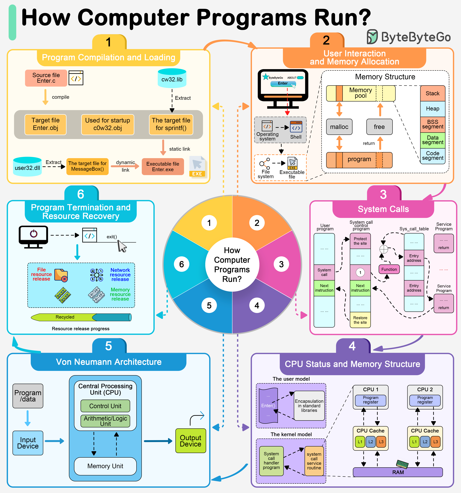

# Introduction and basics (Linux)

[← Back to Linux](./README.md) · [↑ Operating Systems](../README.md)

**Prerequisite:** Read [Fundamentals: Kernel and OS architecture](../Fundamentals/1_Kernel_And_OS_Architecture.md) and [User interface and the shell](../Fundamentals/11_User_Interface_And_Shell.md) for OS-agnostic theory. Here we cover **how Linux implements** those ideas: the Linux kernel, system calls, boot, and essential commands.

**Hands-on:** For a step-by-step path (install a distro, boot process, run commands on a VM), see [Learn Linux — hands-on](./00_Learn_Linux_Hands_On.md).

---

## The Linux kernel: monolithic and modular

Linux uses a **monolithic kernel**: process, memory, file systems, device drivers, and network stack run in kernel space. The kernel is **modular**: many drivers are **loadable kernel modules (LKMs)** — load/unload with `insmod`, `rmmod`, `modprobe` without rebooting. **Kernel version:** `uname -r`. For full OS/kernel theory see [Fundamentals: Kernel and OS architecture](../Fundamentals/1_Kernel_And_OS_Architecture.md).

### How loadable kernel modules (LKMs) work

The kernel can load **modules** at runtime so you don’t need to rebuild the kernel or reboot to add support for new hardware or features. Modules live under `/lib/modules/$(uname -r)/` and are loaded on demand (e.g. when a device is detected) or explicitly by an admin.

```
  Kernel (core always in memory)
       │
       ├── Built-in: scheduler, memory mgmt, core VFS, core net stack
       │
       └── Loadable modules (.ko files)
             ├── Device drivers (e.g. nvidia.ko, usb_storage.ko)
             ├── File system drivers (e.g. nfs.ko, overlay.ko)
             ├── Network protocols (e.g. nf_nat.ko)
             └── Other (e.g. tun.ko for VPN)
```

**Inspect and manage modules:**

```bash
# List loaded modules (name, size, use count, dependencies)
lsmod

# Detailed info for a module (path, description, parms, dependencies)
modinfo nfs
modinfo overlay

# Load a module (and its dependencies)
sudo modprobe nfs
# Unload (only if use count is 0)
sudo modprobe -r nfs

# Low-level load/unload (modprobe is preferred)
sudo insmod /lib/modules/$(uname -r)/kernel/fs/nfs/nfs.ko
sudo rmmod nfs

# Blacklist a module so it never auto-loads (e.g. to avoid a buggy driver)
echo "blacklist module_name" | sudo tee /etc/modprobe.d/blacklist.conf
sudo update-initramfs -u   # Debian/Ubuntu; on RHEL: dracut --force
```

**Why this matters:** In containers and minimal systems you often need specific modules (e.g. `overlay`, `veth`, `nf_nat`) loaded on the host. Knowing `lsmod` and `modprobe` lets you verify and fix missing support.

---

## Recap: OS and kernel (concepts)

The OS is a program that runs all the time. It:

- **Assigns resources** — CPU, memory, disk, and I/O devices — to programs in a fair and secure way.
- **Provides an environment** so that users can run applications conveniently and efficiently.
- **Mediates access** to hardware so that applications do not have to talk to devices directly.

Conceptually, the stack looks like this:

```
    +------------------------------------------+
    |  User / Application programs             |
    +------------------------------------------+
    |  System programs (compilers, editors…)   |
    +------------------------------------------+
    |  Operating system (kernel + shell, etc.) |
    +------------------------------------------+
    |  Hardware (CPU, memory, disk, I/O)       |
    +------------------------------------------+
```

---

## How users interact with the OS

Users and scripts interact with the OS mainly in two ways:

| Interface | Description | Examples |
|-----------|-------------|----------|
| **CLI** (Command-Line Interface) | Text-based; you type commands and see text output. | Bash, Zsh, PowerShell |
| **GUI** (Graphical User Interface) | Windows, icons, menus. | Desktop environments (GNOME, KDE), Windows Explorer, macOS Finder |

In DevOps and servers, the **CLI** is primary: automation, SSH, containers, and pipelines all rely on shell commands.

---

## Main components: Kernel and Shell

| Component | Role |
|-----------|------|
| **Kernel** | Core of the OS. Talks directly to hardware: process scheduling, memory management, file systems, device drivers. |
| **Shell** | Outermost layer. Takes user input (commands), interprets them, and calls the kernel or other programs. |

So when you run a command in a terminal, the **shell** parses it and uses **system calls** to ask the **kernel** to do the work (e.g. create a process, open a file).



*Image: [ByteByteGo – How Do Computer Programs Run?](https://bytebytego.com/guides/how-do-computer-programs-run/).*

---

## Goals of an operating system

**Primary:** convenient and safe program execution, resource management, user convenience.

**Secondary:** reliability, efficient use of CPU/memory/I/O, modularity, ease of debugging.

For DevOps, the OS must be scriptable (CLI), stable under load, and manageable remotely—which is why Linux is so common on servers and in containers.

---

## Types of operating systems

| Type | Brief idea | Example / use |
|------|------------|----------------|
| Batch | Jobs run in batches, no direct user interaction during run. | Historical; batch jobs today (cron, queues). |
| Multiprogramming | Several programs in memory; CPU switches between them. | Modern general-purpose OS. |
| Multitasking / Time-sharing | Multiple users or tasks share the CPU with quick switching. | Linux, Windows, macOS. |
| Real-time | Tasks must complete within strict time bounds. | Embedded, industrial, some RTOS. |
| Distributed | Systems across many machines appear as one. | Clusters, clouds, microservices. |

Linux and Windows are **multitasking, multiprogramming** systems.

---

## What happens when you turn on the computer (boot process)

Rough sequence:

1. **Power-on** → hardware runs firmware (e.g. BIOS or UEFI).
2. **Firmware** runs **POST** (Power-On Self Test), then finds a **boot loader** on disk (e.g. GRUB on Linux).
3. **Boot loader** loads the **kernel** into memory and starts it.
4. **Kernel** initializes hardware, mounts the root file system, starts the first user-space process (e.g. `systemd` with PID 1).
5. **Init system** starts services, getty (login prompts), and the rest of the user environment.

**Concepts (hands-on):** On most modern Linux systems the boot uses **GRUB2** and **systemd**. The process is often described in four stages: (1) **BIOS/POST** — power-on self-test, checks RAM, disk, keyboard, etc.; (2) **Bootloader (GRUB2)** — MBR/first sector (e.g. `/dev/sda`), loads kernel from `/boot`, menu at `/boot/grub2/grub.cfg` (or `/boot/grub/grub.cfg`); (3) **Kernel** — self-extracts, mounts root, runs `/sbin/init` (PID 1); (4) **systemd** — parent of all processes, mounts filesystems from `/etc/fstab`, starts daemons and the default **target** (run level). Init mounts **initrd/initramfs** as a temporary root until the real root is available; kernel and initrd live under `/boot`.


*Image: [ByteByteGo – Linux Boot Process Explained](https://bytebytego.com/guides/linux-boot-process-explained/).*

**systemd targets (run levels):** `multi-user.target` = text multiuser (no GUI, like runlevel 3); `graphical.target` = GUI (runlevel 5); `rescue.target` = single-user rescue; `reboot.target` (runlevel 6); `poweroff.target` (runlevel 0). Server defaults are often `multi-user.target`; desktop defaults are `graphical.target`.

On Linux you can inspect boot and kernel messages with:

```bash
# Recent kernel and boot messages
journalctl -b

# Kernel command line
cat /proc/cmdline

# Kernel version
uname -r
```

**systemd targets** (run levels) — The default target is usually `graphical.target` (desktop) or `multi-user.target` (text, servers). You can switch or set default:

```bash
# Current default target (hands-on: see which run level you are in)
systemctl get-default

# Switch to multi-user (no GUI) or rescue (single-user maintenance)
sudo systemctl isolate multi-user.target
sudo systemctl isolate rescue.target

# Set default for next boot
sudo systemctl set-default multi-user.target

# Traditional runlevel-style switch (init): init 3 = multiuser, init 5 = graphical, init 6 = reboot, init 0 = poweroff
sudo init 3
sudo init 6
sudo init 0
```

**Interrupting boot** — At the GRUB menu, press `e` to edit the selected entry; add `single` or `systemd.unit=rescue.target` to the kernel command line, then boot to get a rescue/maintenance shell (e.g. to fix fstab or password).

### Managing services (systemd / systemctl)

**Concepts (hands-on):** systemd is the parent of all processes (PID 1) on most Linux distros. **Units** include services (`.service`), mounts (`.mount`), and sockets (`.socket`). Use **systemctl** to start, stop, enable (autostart at boot), disable, and check status.

```bash
systemctl --version
systemctl start httpd.service
systemctl stop httpd.service
systemctl restart httpd.service
systemctl reload httpd.service
systemctl status httpd.service
systemctl is-active httpd.service
systemctl enable httpd.service
systemctl disable httpd.service
systemctl mask httpd.service
systemctl unmask httpd.service
systemctl list-units --type=service
systemctl list-unit-files --type=service
systemctl --failed
systemd-analyze
systemd-analyze blame
systemd-analyze critical-chain
```

**Legacy (SysV):** On older systems (e.g. CentOS 6), **chkconfig** managed runlevel startup: `chkconfig --list`, `chkconfig --level 35 httpd on`, `chkconfig servicename off`. On systemd systems use **systemctl** instead.

**Disable unwanted services:** List running services with `systemctl list-units --type=service --state=running`; list enabled with `systemctl list-unit-files --type=service --state=enabled`. Check listening ports with `ss -tuln` or `netstat -tuln`. Disable and stop unneeded services (e.g. avahi-daemon, bluetooth, cups, postfix on a minimal server) with `systemctl disable <service>` and `systemctl stop <service>`. Use `systemctl mask <service>` to prevent manual or dependency start; `systemctl unmask` to restore. Use `systemd-analyze blame` to see which services slow boot.

**Unit types:** systemd manages several unit types: **.service** (daemons), **.socket** (socket activation), **.timer** (time-based, like cron), **.mount** / **.automount**, **.target** (group of units), **.path** (path-based activation). Unit files live in `/usr/lib/systemd/system/` (vendor) and overrides in `/etc/systemd/system/`.

**Timers (replace cron for system tasks):** A **.timer** unit triggers a **.service** on a schedule (calendar or monotonic). Example: `mybackup.timer` with `OnCalendar=daily` runs `mybackup.service` once per day. List timers with `systemctl list-timers --all`. Timers support calendar expressions (e.g. `Mon *-*-* 02:00`) and can replace cron for daemon-style jobs while keeping logs in the journal.

**Socket activation:** A **.socket** unit creates a listening socket; when a connection arrives, systemd starts the corresponding **.service** and hands off the socket. This allows on-demand startup (e.g. only start the service when needed) and parallel startup. Config in the `.socket` file (ListenStream=, etc.) and the service unit (accept=yes for multi-instance).

See [Learn Linux — hands-on](./00_Learn_Linux_Hands_On.md) for full service and startup management.

---

## System calls

**System calls** are the interface between user programs and the kernel. When a program needs to read a file, create a process, or allocate memory, it does so via a system call. The kernel then performs the operation and returns a result.

**Flow from your command to the kernel:**

```
  You type:  ls /tmp
       │
       ▼
  Shell (e.g. bash) parses the line, then:
       │
       ├── fork()     → kernel creates a new process (copy of shell)
       ├── execve()  → kernel replaces that process with /usr/bin/ls, argv=["ls","/tmp"]
       │
       ▼
  ls runs in the new process:
       │
       ├── openat("/tmp", ...)  → kernel opens directory, returns fd
       ├── getdents64(fd, ...)  → kernel reads directory entries
       ├── write(1, ...)        → kernel writes to stdout
       ├── close(fd)
       └── exit_group(0)
       │
       ▼
  Shell wait()s for the child, then prints the prompt again.
```

Common categories:

- **Process control** — `fork`, `clone`, `execve`, `exit`, `wait4`
- **File management** — `openat`, `read`, `write`, `close`, `stat`
- **Device / I/O** — `read`, `write`, `ioctl`
- **Information** — `uname`, `getpid`, `getuid`
- **Communication** — `pipe`, `socket`, `bind`, `connect`, `sendto`, `recvfrom`

**Trace system calls** to see exactly what a program asks of the kernel:

```bash
# Trace only file-related syscalls of ls
strace -e trace=openat,read,write,close,getdents64 ls /tmp

# Count syscalls made by one command
strace -c ls /tmp

# Trace a running process (e.g. debug why a daemon is stuck)
sudo strace -p $(pgrep -f nginx)
```

Example snippet of `strace -e trace=openat,open,read,write ls /tmp` (conceptually):

```
openat(AT_FDCWD, "/tmp", O_RDONLY|O_NONBLOCK|O_CLOEXEC|O_DIRECTORY) = 3
getdents64(3, ...) = 512
write(1, "file1\nfile2\n", ...) = 13
close(3) = 0
```

This shows that `ls` opened `/tmp` (fd 3), read directory entries, wrote to stdout (fd 1), and closed the directory. Understanding this helps with debugging permission errors, missing files, or I/O bottlenecks.

---

## Linux directory structure and important paths (hands-on)

**Concepts:** In Linux, *everything is a file* (or a process). Files fall into: **general files** (regular data: documents, binaries); **directory files** (contain other files); **device files** (in `/dev`, interface to drivers). Key directories:

| Directory | Purpose |
|-----------|--------|
| `/` | Root of the hierarchy; all other paths stem from here. Not the same as `/root` (root user’s home). |
| `/boot` | Bootloader (GRUB), kernel (`vmlinuz`), initramfs. |
| `/etc` | System-wide configuration (services, apps, fstab, passwd, hosts, resolv.conf). |
| `/bin`, `/usr/bin` | User executables (ls, cat, grep, etc.). |
| `/sbin`, `/usr/sbin` | Admin-only executables (fdisk, iptables, systemctl). |
| `/usr` | Read-only system data: binaries, libs, share, include. |
| `/var` | Variable data: logs, cache, spool, lib (e.g. databases). |
| `/dev` | Device files (sda, null, tty). |
| `/proc`, `/sys` | Virtual filesystems: running processes and kernel state. |
| `/home` | User home directories. `/root` = root’s home. |
| `/tmp`, `/run` | Temporary and runtime data (cleared on reboot for `/run`). |
| `/mnt`, `/media` | Mount points for disks and removable media. |
| `/opt` | Add-on / third-party software. |
| `/srv` | Service-specific data (e.g. web, FTP). |
| `/lib` | Essential libraries for `/bin` (and `/sbin`). |
| `lost+found` | fsck can place recovered files here. |

**Important files (hands-on):** `/etc/fstab` (mount points), `/etc/passwd` (user info), `/etc/hosts` (hostname→IP), `/etc/resolv.conf` (DNS), `/etc/crontab` (scheduled tasks), `/proc/cpuinfo`, `/proc/meminfo`, `/proc/mounts`, `/var/log/` (logs). See [Storage and I/O](./8_Storage_And_IO.md) for a fuller FHS and file-by-file description.

---

## Common operating systems (and why Linux in DevOps)

| OS | Typical use |
|----|------------------|
| **Linux** | Servers, cloud, containers, CI/CD, most DevOps tooling. |
| **Windows** | Desktops, Windows servers, .NET, some enterprise workloads. |
| **macOS** | Developer machines, Apple ecosystem. |
| **Unix** | Legacy and some enterprise servers. |

Linux dominates in DevOps because it is open, scriptable, lightweight, and runs everywhere (bare metal, VMs, containers).

---

## Essential Linux commands for OS basics

These help you inspect the running system and its environment:

```bash
# OS and kernel
uname -a
uname -r -m -n
cat /etc/os-release
lsb_release -a            # If lsb-release installed

# Current user and IDs
whoami
id
groups

# Shell and environment
echo $SHELL
env | head -20
printenv
export VAR=value

# Load and uptime
uptime
cat /proc/loadavg
cat /proc/uptime

# Hardware and CPU
lscpu
lsmem
free -h
nproc
```

---

## More system inspection commands

```bash
# Host and domain
hostname
hostnamectl
domainname

# Date and time
date
timedatectl
hwclock

# Logs (systemd)
journalctl -b
journalctl -xe
journalctl -f

# Kernel messages
dmesg | tail
dmesg -w
```

---

## Summary

- The OS is the layer between hardware and user/apps; it manages resources and provides the execution environment.
- **Kernel** = core (scheduling, memory, files, devices); **Shell** = user-facing command interpreter.
- Users interact via **CLI** (common in DevOps) or **GUI**.
- **System calls** are how programs use kernel services.
- **Boot**: firmware → boot loader → kernel → init (e.g. systemd) → services and login.
- For DevOps, Linux is the default choice on servers and in containers; knowing these basics helps with scripting, debugging, and automation.

---

## Further reading

**Official Linux documentation**

- [The Linux Kernel documentation](https://docs.kernel.org/) — Kernel overview, process management, boot, syscalls.
- [Linux man pages: syscalls](https://man7.org/linux/man-pages/man2/syscalls.2.html) — List of Linux system calls.
- [Linux man pages: uname(2)](https://man7.org/linux/man-pages/man2/uname.2.html) — Kernel version and system info.

**Install, boot, and services**

- [What Is Linux? and How Does Linux Work?](https://www.tecmint.com/what-is-linux/) — Kernel, CLI, desktop environments, distributions.
- [A Basic Guide to Linux Boot Process](https://www.tecmint.com/linux-boot-process/) — Four stages (POST, GRUB2, kernel, systemd), run levels, `systemctl get-default`, `init`.
- [Linux Directory Structure and Important Files Paths](https://www.tecmint.com/linux-directory-structure-and-important-files-paths-explained/) — /, /boot, /etc, /bin, /sbin, /usr, /var, /dev, /proc, important config files.
- [Manage systemd and systemctl](https://www.tecmint.com/manage-services-using-systemd-and-systemctl-in-linux/) — Start/stop/enable/disable/mask units, list-units, --failed, systemd-analyze.
- [chkconfig and systemctl](https://www.tecmint.com/chkconfig-command-examples/) — Legacy chkconfig (runlevels) vs systemctl on modern Linux.
- [Stop and disable unwanted services](https://www.tecmint.com/remove-unwanted-services-from-linux/) — List running/enabled services, ss/netstat for ports, disable/mask, systemd-analyze blame.

**Concepts and tutorials**

- [Introduction to Operating System (GeeksforGeeks)](https://www.geeksforgeeks.org/operating-systems/introduction-of-operating-system-set-1/)
- [Types of Operating Systems](https://www.geeksforgeeks.org/operating-systems/types-of-operating-systems/)
- [Kernel in Operating System](https://www.geeksforgeeks.org/operating-systems/kernel-in-operating-system/)
- [Shell in Operating System](https://www.geeksforgeeks.org/operating-systems/shell-in-operating-system/)
- [Introduction to System Call](https://www.geeksforgeeks.org/operating-systems/introduction-of-system-call/)
- [What happens when we turn on computer?](https://www.geeksforgeeks.org/operating-systems/what-happens-when-we-turn-on-computer/)
- [Functions of Operating System](https://www.geeksforgeeks.org/operating-systems/functions-of-operating-system/)
- [32-bit vs 64-bit Operating Systems](https://www.geeksforgeeks.org/operating-systems/32-bit-vs-64-bit-operating-systems/)
